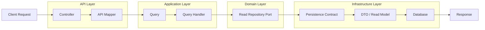
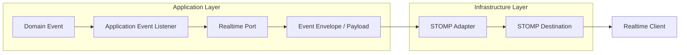

# Pabal Messenger

Pabal Messenger는 Java 25와 Spring Boot 4.0.2 기반의 메시징 백엔드입니다. 현재 코드는 DDD, 헥사고날 아키텍처, CQRS 스타일의 command/query 흐름, 멀티테넌시, JWT 인증, WebSocket/STOMP realtime 전달을 중심으로 구성되어 있습니다.

이 저장소의 핵심 설계 방향은 도메인 모델을 JPA와 HTTP/WebSocket 프로토콜에서 분리하고, 계층 경계는 record DTO, command/query, persistence `State`, `Persisted*` wrapper, realtime payload/envelope로 명시적으로 넘기는 것입니다.

## 현재 구현 범위

- 채팅방 생성: direct, group, channel
- 채팅방 참여/나가기, 채널 삭제 예약/즉시 삭제
- 메시지 전송, 답장, 수정, 삭제, 읽음 처리
- 방 목록, 메시지 목록, 단건 메시지, unread count 조회
- 메시지/멤버/읽음 이벤트의 STOMP realtime 발행
- typing start/stop STOMP command
- JWT Resource Server 기반 HTTP 인증
- STOMP connect 인증과 room topic subscribe 인가
- local/test 프로필용 개발 JWT 발급 endpoint
- H2 local/test persistence, PostgreSQL runtime driver, Redis local compose

## 기술 스택

- Java 25
- Spring Boot 4.0.2
- Gradle Wrapper 9.3.0
- Spring Web MVC
- Spring WebSocket / STOMP
- Spring Security, OAuth2 Resource Server, Spring Security Messaging
- Spring Data JPA, Hibernate
- H2 Database for local/test
- PostgreSQL runtime driver
- Redis dependency and local Docker Compose service
- Testcontainers, JUnit 5, Mockito
- Lombok

## 아키텍처

루트 패키지는 `com.polarishb.pabal`입니다.

```text
src/main/java/com/polarishb/pabal
├── common                  # 공통 API 응답, 예외, CQRS marker, event publisher, persistence base
├── infrastructure          # 전역 infrastructure 설정
├── security                # JWT 인증, principal, security config, local dev token
└── messenger
    ├── api                 # HTTP/WS controller, request/response, protocol mapper
    ├── application         # command/query handler, orchestration service, event listener, ports
    ├── contract            # persistence state/wrapper/mapper, realtime payload/envelope
    ├── domain              # pure domain entity, value object, event, exception, repository port
    └── infrastructure      # JPA entity/repository adapter, STOMP adapter, WS config/security, clock adapter
```

### Layer Rules

- `api`는 request/authentication을 command/query로 매핑하고 handler에 위임합니다.
- `application`은 transaction boundary와 use case orchestration을 담당합니다.
- `domain`은 business invariant와 state transition을 담당합니다.
- `contract`는 persistence/realtime boundary shape를 담습니다.
- `infrastructure`는 JPA, STOMP, security channel, clock 같은 기술 구현을 담당합니다.

일반 HTTP command 흐름:

```mermaid
flowchart LR
    A["Client Request"] --> B["Controller"]

    subgraph API["API Layer"]
        B --> C["API Mapper"]
    end

    subgraph APP["Application Layer"]
        C --> D["Command"]
        D --> E["Command Handler"]
    end

    subgraph DOMAIN["Domain Layer"]
        E --> F["Domain Model"]
        F --> G["Repository Port"]
    end

    subgraph INFRA["Infrastructure Layer"]
        G --> H["Persistence Contract"]
        H --> I["JPA Adapter"]
        I --> J["Database"]
    end

    J --> K["Result"]
    K --> L["API Mapper"]
    L --> M["Response"]
```



일반 query 흐름:



Realtime 흐름:



## Persistence Boundary

이 저장소는 persistence에 세 가지 표현을 둡니다.

1. Domain model
   - 예: `Message`, `ChatRoom`, `ChatRoomMember`, `DirectChatMapping`
   - JPA/Spring/transport annotation을 두지 않습니다.
   - `create(...)`, `reconstitute(...)`, `snapshot()` 같은 명시적 생성/복원 경로를 사용합니다.

2. Persistence contract
   - 예: `MessageState`, `PersistedMessage`, `MessagePersistenceMapper`
   - DB metadata와 domain state를 immutable record로 운반합니다.
   - application/domain과 infrastructure 사이의 persistence boundary입니다.

3. Infrastructure JPA entity
   - 예: `MessageEntity`, `ChatRoomEntity`, `ChatRoomMemberEntity`, `DirectChatMappingEntity`
   - JPA annotation, optimistic lock, index/unique constraint, mutable apply 로직을 포함합니다.
   - API, application, domain으로 직접 새지 않아야 합니다.

## HTTP API

모든 `/api/**` 요청은 JWT bearer token 인증이 필요합니다. `Authentication`은 `PabalPrincipal`로 변환되며 command/query에는 `tenantId`, `userId`가 명시적으로 들어갑니다.

### Command API

Base path: `/api/chat/command`

| Method | Path | 설명 |
| --- | --- | --- |
| `POST` | `/chat-rooms/{chatRoomId}/messages` | 메시지 전송 |
| `POST` | `/chat-rooms/{chatRoomId}/messages/{replyToMessageId}/replies` | 답장 전송 |
| `PATCH` | `/messages/{messageId}` | 메시지 수정 |
| `DELETE` | `/messages/{messageId}` | 메시지 삭제 |
| `POST` | `/chat-rooms/{chatRoomId}/read` | 메시지 읽음 처리 |
| `POST` | `/chat-rooms/{chatRoomId}/join` | 방 참여 |
| `POST` | `/chat-rooms/{chatRoomId}/leave` | 방 나가기 |
| `POST` | `/group-rooms` | 그룹방 생성 |
| `POST` | `/channel-rooms` | 채널방 생성 |
| `POST` | `/chat-rooms/{chatRoomId}/deletion-schedule` | 채널 삭제 예약 |
| `DELETE` | `/chat-rooms/{chatRoomId}` | 삭제 예약된 채널 즉시 삭제 |
| `POST` | `/direct-rooms` | 1:1 방 조회 또는 생성 |

주요 request body:

```json
{
  "clientMessageId": "018f0000-0000-7000-8000-000000000001",
  "content": "hello"
}
```

```json
{
  "participantIds": ["018f0000-0000-7000-8000-000000000002"],
  "roomName": "project room"
}
```

```json
{
  "workspaceId": "018f0000-0000-7000-8000-000000000010",
  "channelName": "general",
  "isPrivate": false,
  "description": "team channel",
  "participantIds": []
}
```

### Query API

Base path: `/api/chat/query`

| Method | Path | 설명 |
| --- | --- | --- |
| `GET` | `/chat-rooms` | 내 방 목록 조회 |
| `GET` | `/chat-rooms/{chatRoomId}/messages?cursor={sequence}&size={1..100}` | 메시지 페이지 조회 |
| `GET` | `/chat-rooms/{chatRoomId}/messages/{messageId}` | 메시지 단건 조회 |
| `GET` | `/chat-rooms/{chatRoomId}/unread-count` | unread count 조회 |

`listMessages`의 기본 `size`는 50이고, API parameter validation상 허용 범위는 1에서 100입니다.

## WebSocket / STOMP

기본 endpoint는 `/websocket`이며, SockJS가 활성화되어 있습니다. application destination prefix는 `/app`입니다.

Inbound command:

| Destination | Payload |
| --- | --- |
| `/app/chat.typing.start` | `{ "tenantId": "...", "chatRoomId": "..." }` |
| `/app/chat.typing.stop` | `{ "tenantId": "...", "chatRoomId": "..." }` |

Subscriptions:

| Destination | 설명 |
| --- | --- |
| `/topic/tenants/{tenantId}/chat-rooms/{chatRoomId}/events` | `RoomEventEnvelope` room event |
| `/topic/tenants/{tenantId}/chat-rooms/{chatRoomId}/typing` | typing event |
| `/user/queue/chat.control` | subscription revocation 같은 user control event |

Room topic 구독은 `RoomSubscriptionAuthorizationManager`가 tenant 일치 여부, room 상태, active membership을 확인합니다.

발행되는 room event type:

- `MESSAGE_SENT`
- `MESSAGE_EDITED`
- `MESSAGE_DELETED`
- `MESSAGE_READ`
- `MEMBER_JOINED`
- `MEMBER_LEFT`

## 실행

JDK 25가 필요합니다.

테스트:

```bash
./gradlew test
```

로컬 실행:

```bash
SPRING_PROFILES_ACTIVE=local ./gradlew bootRun
```

`local` profile은 H2 in-memory DB를 사용하고, Spring Boot Docker Compose 연동으로 `compose.local.yaml`의 Redis 7.2 컨테이너를 시작합니다. Docker가 실행 중이어야 합니다.

local/test profile에서는 개발용 JWT를 발급할 수 있습니다.

```bash
curl "http://localhost:8080/dev/token?userId=018f0000-0000-7000-8000-000000000001&tenantId=018f0000-0000-7000-8000-000000000100"
```

응답의 `accessToken`을 HTTP API 호출 시 bearer token으로 사용합니다.

```bash
curl \
  -H "Authorization: Bearer ${ACCESS_TOKEN}" \
  "http://localhost:8080/api/chat/query/chat-rooms"
```

## 설정

기본 설정 파일:

- `src/main/resources/application.yaml`
- `src/main/resources/application-local.yaml`
- `src/test/resources/application-test.yaml`

운영 계열 profile에서는 최소한 다음 값이 필요합니다.

- `ISSUER_URI`: JWT issuer URI
- `pabal.security.jwt.audience`
- `pabal.security.jwt.user-id-claim`
- `pabal.security.jwt.tenant-id-claim`
- `pabal.security.jwt.principal-claim`

STOMP broker relay를 활성화할 경우 다음 환경 변수도 설정해야 합니다.

- `STOMP_CLIENT_LOGIN`
- `STOMP_CLIENT_PASSCODE`
- `STOMP_SYSTEM_LOGIN`
- `STOMP_SYSTEM_PASSCODE`

`pabal.websocket.relay.enabled=false`이면 simple broker를 사용합니다.

## 테스트 구성

현재 테스트는 다음 레이어를 중심으로 구성되어 있습니다.

- domain model invariant test
- application command/query handler test
- application event listener test
- HTTP command controller test
- STOMP realtime adapter test
- JWT authentication token test
- Spring domain event publisher integration test

## 운영 전 보완 필요 항목

현재 구조는 서비스 설계를 잘 분리하고 있지만, 운영 투입 전에는 다음 항목을 우선 확인해야 합니다.

- 채널명 중복을 DB unique constraint와 예외 번역으로 보장
- 동일 `clientMessageId` 동시 전송 시 unique violation을 idempotent result로 번역
- 방 목록 조회의 unread count N+1 제거
- room/direct/channel 생성 시 participant가 실제 tenant 소속 사용자라는 검증 추가
- validation/security/JWT 예외의 공통 `ErrorResponse` 매핑 강화
- WebSocket typing request validation 강화
- realtime event 유실 방지를 위한 outbox/retry/DLQ 검토
- 운영용 security filter에서 dev endpoint와 basic auth 노출 여부 재점검
