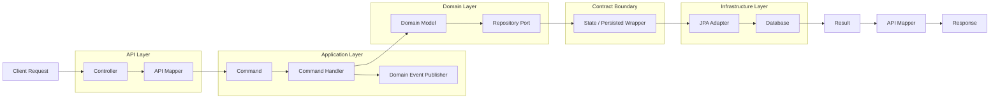
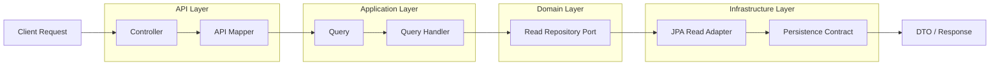
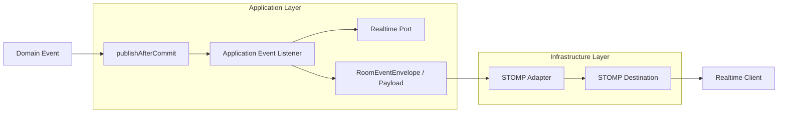

# Pabal Messenger

최종 구현 점검일: 2026-04-23

Pabal Messenger는 Java 25와 Spring Boot 4.0.2 기반의 메시징 백엔드입니다. 현재 코드는 DDD, 헥사고날 아키텍처, CQRS 스타일의 command/query 흐름, 멀티테넌시, JWT 인증, WebSocket/STOMP realtime 전달을 중심으로 구성되어 있습니다.

핵심 설계 방향은 도메인 모델을 HTTP/WebSocket/JPA 세부 구현에서 분리하고, 계층 경계는 record DTO, command/query, persistence `State`, `Persisted*` wrapper, realtime payload/envelope로 명시적으로 넘기는 것입니다.

## 현재 구현 범위

- 방 생성: direct, group, channel
- direct 방 조회 또는 생성: 같은 tenant의 두 사용자 조합을 정렬한 unique mapping으로 중복 생성 방지
- group 방 이름: 요청 이름이 없으면 요청자와 참여자 UUID 앞 8자리 기반 fallback 이름 자동 생성
- channel 방 생성: workspace별 채널명 중복 사전 검증, DB unique constraint 보강
- 방 참여/재참여/나가기: active membership과 last-read baseline 관리
- 채널 삭제 lifecycle: 생성자만 삭제 예약 가능, 기본 30일 보존 후 즉시 삭제 상태 전이 지원
- 메시지 전송/답장: 방 상태, active membership, reply target 검증 후 room-local sequence 할당
- 메시지 idempotency: `tenantId + chatRoomId + senderId + clientMessageId` 기준 중복 전송 결과 반환
- 메시지 수정/삭제: 작성자 본인만 가능, 삭제 메시지는 재수정/재삭제 방지
- 읽음 처리: 메시지 sequence 기반 read cursor 전진, cursor가 실제로 전진할 때만 read event 발행
- 조회 API: 내 방 목록, 메시지 cursor page, 단건 메시지, unread count
- realtime: 메시지/멤버/읽음 이벤트를 transaction commit 이후 STOMP로 발행
- typing command: STOMP inbound command로 start/stop 발행
- 인증/인가: HTTP JWT Resource Server, STOMP CONNECT bearer token 인증, room topic subscribe 인가
- 개발 지원: local/test profile용 JWT 발급 endpoint, H2 local/test persistence, Redis local compose
- 공통 오류 응답: `ApiError` record, validation/security/domain/persistence 예외 매핑, trace id 포함

## 기술 스택

- Java 25
- Spring Boot 4.0.2
- Gradle Wrapper 9.3.0
- Spring Web MVC, Spring WebFlux dependency
- Spring WebSocket / STOMP
- Spring Security, OAuth2 Resource Server, Spring Security Messaging
- Spring Data JPA, Hibernate, JDBC Template
- H2 Database for local/test
- PostgreSQL runtime driver
- Redis dependency and local Docker Compose service
- Kafka dependency
- Spring Boot Actuator, OpenTelemetry starter
- Testcontainers, JUnit 5, Mockito
- Lombok

## 아키텍처

루트 패키지는 `com.polarishb.pabal`입니다.

```text
src/main/java/com/polarishb/pabal
├── common                  # 공통 API 응답, 예외, CQRS marker, event publisher, persistence base
├── infrastructure          # 전역 infrastructure 설정
├── security                # JWT 인증, principal, security config, local dev token
└── messenger
    ├── api                 # HTTP/WS controller, request/response, protocol mapper
    ├── application         # command/query handler, orchestration service, event listener, ports
    ├── contract            # persistence state/wrapper/mapper, realtime payload/envelope
    ├── domain              # pure domain entity, value object, event, exception, repository port
    └── infrastructure      # JPA entity/repository adapter, STOMP adapter, WS config/security, clock adapter
```

### Layer Rules

- `api`는 request/authentication/principal을 command/query로 매핑하고 handler에 위임합니다.
- `application`은 transaction boundary, use case orchestration, port 호출, after-commit event 발행을 담당합니다.
- `domain`은 business invariant와 state transition을 담당합니다.
- `contract`는 persistence/realtime boundary shape를 담습니다.
- `infrastructure`는 JPA, JDBC, STOMP, security channel, clock 같은 기술 구현을 담당합니다.

일반 HTTP command 흐름:



일반 query 흐름:



Realtime 흐름:



## Persistence Boundary

이 저장소는 persistence에 세 가지 표현을 둡니다.

1. Domain model
   - 예: `Message`, `ChatRoom`, `ChatRoomMember`, `DirectChatMapping`
   - JPA/Spring/transport annotation을 두지 않습니다.
   - `create(...)`, `join(...)`, `reconstitute(...)`, `snapshot()` 같은 명시적 생성/복원 경로를 사용합니다.

2. Persistence contract
   - 예: `MessageState`, `PersistedMessage`, `MessagePersistenceMapper`
   - DB metadata와 domain state를 immutable record로 운반합니다.
   - application/domain과 infrastructure 사이의 persistence boundary입니다.

3. Infrastructure JPA entity
   - 예: `MessageEntity`, `ChatRoomEntity`, `ChatRoomMemberEntity`, `DirectChatMappingEntity`
   - JPA annotation, optimistic lock, index/unique constraint, mutable apply 로직을 포함합니다.
   - API, application, domain으로 직접 새지 않아야 합니다.

Repository는 aggregate-facing repository와 read/write repository로 나뉩니다.

- `MessageRepository`, `ChatRoomRepository`, `ChatRoomMemberRepository`, `DirectChatMappingRepository`: application이 사용하는 aggregate-facing port
- `*ReadRepository`, `*WriteRepository`: CQRS 스타일의 read/write adapter 분리
- `*RepositoryImpl`: read/write repository를 조합하는 infrastructure adapter
- `ChatRoomSequenceRepository`: 메시지 전송 시 room-local sequence를 DB update로 할당하고 last message snapshot을 갱신

ID는 infrastructure JPA entity에서 `@UuidV7Generated`로 생성합니다. 기본 모드는 monotonic UUIDv7이며, Hibernate generator는 assigned identifier도 허용합니다.

## Domain Rules

- `ChatRoom`
  - `ACTIVE` 상태에서만 send/read/subscribe/join 허용
  - channel만 삭제 예약/즉시 삭제 가능
  - 삭제 예약 시 `PENDING_DELETION`, 즉시 삭제 시 `DELETED`로 전이
  - 기본 삭제 보존 기간은 30일

- `Message`
  - 본문은 non-blank, 최대 5000자
  - 전송/답장은 `MessageStatus.ACTIVE`
  - 수정 시 `EDITED`, 삭제 시 `DELETED`
  - 삭제된 메시지는 수정/삭제 불가

- `ChatRoomMember`
  - `leftAt == null`이면 active member
  - 재참여 시 `leftAt`, read cursor를 초기화하고 현재 room sequence를 baseline으로 사용
  - read cursor는 더 낮은 sequence로 되돌리지 않음

- `DirectChatMapping`
  - direct room은 서로 다른 두 사용자 간에만 생성 가능
  - 사용자 UUID를 정렬해 `userIdMin/userIdMax`로 저장하고 unique constraint로 중복 방지

- `RoomName`
  - channel 이름은 필수이며 한글, 영문, 숫자, 언더스코어, 하이픈만 허용
  - group/direct 이름은 optional이며 최대 50자
  - group 이름 미지정 시 requester와 participants를 중복 제거/정렬한 뒤 UUID 앞 8자리 fallback으로 생성

## HTTP API

모든 `/api/**` 요청은 JWT bearer token 인증이 필요합니다. JWT는 `PabalPrincipal`로 변환되며 command/query에는 `tenantId`, `userId`가 명시적으로 들어갑니다.

### Command API

Base path: `/api/chat/command`

| Method | Path | 설명 | Response |
| --- | --- | --- | --- |
| `POST` | `/chat-rooms/{chatRoomId}/messages` | 메시지 전송 | `SendMessageResponse` |
| `POST` | `/chat-rooms/{chatRoomId}/messages/{replyToMessageId}/replies` | 답장 전송 | `SendMessageResponse` |
| `PATCH` | `/messages/{messageId}` | 메시지 수정 | `EditMessageResponse` |
| `DELETE` | `/messages/{messageId}` | 메시지 삭제 | `DeleteMessageResponse` |
| `POST` | `/chat-rooms/{chatRoomId}/read` | 메시지 읽음 처리 | `204 No Content` |
| `POST` | `/chat-rooms/{chatRoomId}/join` | 방 참여 또는 재참여 | `204 No Content` |
| `POST` | `/chat-rooms/{chatRoomId}/leave` | 방 나가기 | `204 No Content` |
| `POST` | `/group-rooms` | 그룹방 생성 | `CreateRoomResponse` |
| `POST` | `/channel-rooms` | 채널방 생성 | `CreateRoomResponse` |
| `POST` | `/chat-rooms/{chatRoomId}/deletion-schedule` | 채널 삭제 예약 | `204 No Content` |
| `DELETE` | `/chat-rooms/{chatRoomId}` | 삭제 예약된 채널 즉시 삭제 | `204 No Content` |
| `POST` | `/direct-rooms` | 1:1 방 조회 또는 생성 | `GetOrCreateDirectRoomResponse` |

주요 request body:

```json
{
  "clientMessageId": "018f0000-0000-7000-8000-000000000001",
  "content": "hello"
}
```

```json
{
  "participantIds": ["018f0000-0000-7000-8000-000000000002"],
  "roomName": "project room"
}
```

```json
{
  "workspaceId": "018f0000-0000-7000-8000-000000000010",
  "channelName": "general",
  "isPrivate": false,
  "description": "team channel",
  "participantIds": []
}
```

`SendMessageResponse`는 다음 형태입니다.

```json
{
  "messageId": "018f0000-0000-7000-8000-000000000100",
  "clientMessageId": "018f0000-0000-7000-8000-000000000001",
  "createdAt": "2026-04-23T00:00:00Z",
  "duplicated": false
}
```

### Query API

Base path: `/api/chat/query`

| Method | Path | 설명 |
| --- | --- | --- |
| `GET` | `/chat-rooms` | 내 active membership 방 목록 조회 |
| `GET` | `/chat-rooms/{chatRoomId}/messages?cursor={sequence}&size={1..100}` | 메시지 cursor page 조회 |
| `GET` | `/chat-rooms/{chatRoomId}/messages/{messageId}` | 메시지 단건 조회 |
| `GET` | `/chat-rooms/{chatRoomId}/unread-count` | unread count 조회 |

메시지 목록 조회는 sequence 내림차순으로 `size + 1`개를 읽은 뒤 응답은 오래된 메시지부터 정렬해 반환합니다. `cursor`가 없으면 최신 페이지를 읽고, `nextCursor`는 다음 페이지 요청 시 사용할 마지막 sequence입니다. 기본 `size`는 50이고 허용 범위는 1에서 100입니다.

방 목록은 마지막 메시지 시간이 최신인 순서로 정렬하고, 마지막 메시지가 없으면 참여 시간이 최신인 순서로 정렬합니다.

## WebSocket / STOMP

기본 endpoint는 `/websocket`이며, SockJS가 활성화되어 있습니다. application destination prefix는 `/app`입니다.

STOMP `CONNECT`는 native header의 `Authorization: Bearer {token}` 또는 `access_token` 값을 사용합니다. 인증된 principal의 tenant와 request payload 또는 subscription destination의 tenant가 다르면 거부됩니다.

Inbound command:

| Destination | Payload |
| --- | --- |
| `/app/chat.typing.start` | `{ "tenantId": "...", "chatRoomId": "..." }` |
| `/app/chat.typing.stop` | `{ "tenantId": "...", "chatRoomId": "..." }` |

Subscriptions:

| Destination | 설명 |
| --- | --- |
| `/topic/tenants/{tenantId}/chat-rooms/{chatRoomId}/events` | `RoomEventEnvelope` room event |
| `/topic/tenants/{tenantId}/chat-rooms/{chatRoomId}/typing` | typing event |
| `/user/queue/chat.control` | subscription revocation 같은 user control event |

Room topic 구독은 `RoomSubscriptionAuthorizationManager`가 다음 조건을 확인합니다.

- STOMP principal 인증 여부
- destination tenant와 JWT tenant 일치 여부
- room 존재 여부와 `canSubscribe()` 상태
- active membership 여부

발행되는 room event type:

- `MESSAGE_SENT`
- `MESSAGE_EDITED`
- `MESSAGE_DELETED`
- `MESSAGE_READ`
- `MEMBER_JOINED`
- `MEMBER_LEFT`

멤버가 방을 나가면 room event와 함께 해당 사용자에게 `/user/queue/chat.control`로 `RoomSubscriptionRevokedRealtimePayload`가 발행됩니다.

## 보안

HTTP 보안은 stateless JWT Resource Server입니다.

- `/actuator/health`: permit all
- WebSocket endpoint: HTTP handshake permit all, STOMP `CONNECT`에서 token 인증
- `/dev/*`: permit all, local/test profile 개발용
- 그 외 모든 요청: authenticated

JWT 설정은 다음 claim을 사용합니다.

- `pabal.security.jwt.audience`
- `pabal.security.jwt.user-id-claim`
- `pabal.security.jwt.tenant-id-claim`
- `pabal.security.jwt.principal-claim`
- `pabal.security.jwt.clock-skew`

local/test profile에서는 HS256 local secret 기반 `JwtDecoder`/`JwtEncoder`를 사용하고 `/dev/token`으로 개발용 token을 발급할 수 있습니다.

## 오류 응답

HTTP 오류는 공통 `ApiError` 형태로 응답합니다.

```json
{
  "timestamp": "2026-04-23T00:00:00Z",
  "status": 400,
  "code": "CMN002",
  "message": "잘못된 입력입니다",
  "path": "/api/chat/command/group-rooms",
  "traceId": "..."
}
```

validation 오류는 `details`를 포함할 수 있습니다. domain 예외는 `MessengerErrorCode`의 `MSG...` 코드로 매핑되며, optimistic lock과 unique constraint 계열 `DataIntegrityViolationException`은 `409 Conflict`로 응답합니다.

## 실행

JDK 25가 필요합니다.

테스트:

```bash
./gradlew test
```

로컬 실행:

```bash
SPRING_PROFILES_ACTIVE=local ./gradlew bootRun
```

`local` profile은 H2 in-memory DB를 사용하고, Spring Boot Docker Compose 연동으로 `compose.local.yaml`의 Redis 7.2 컨테이너를 시작합니다. Docker가 실행 중이어야 합니다.

local/test profile에서는 개발용 JWT를 발급할 수 있습니다.

```bash
curl "http://localhost:8080/dev/token?userId=018f0000-0000-7000-8000-000000000001&tenantId=018f0000-0000-7000-8000-000000000100"
```

응답의 `accessToken`을 HTTP API 호출 시 bearer token으로 사용합니다.

```bash
curl \
  -H "Authorization: Bearer ${ACCESS_TOKEN}" \
  "http://localhost:8080/api/chat/query/chat-rooms"
```

STOMP `CONNECT` 예시 header:

```text
Authorization: Bearer ${ACCESS_TOKEN}
```

## 설정

기본 설정 파일:

- `src/main/resources/application.yaml`
- `src/main/resources/application-local.yaml`
- `src/test/resources/application-test.yaml`

운영 계열 profile에서는 최소한 다음 값이 필요합니다.

- `ISSUER_URI`
- `pabal.security.jwt.audience`
- `pabal.security.jwt.user-id-claim`
- `pabal.security.jwt.tenant-id-claim`
- `pabal.security.jwt.principal-claim`

STOMP broker relay를 활성화할 경우 다음 환경 변수도 설정해야 합니다.

- `STOMP_CLIENT_LOGIN`
- `STOMP_CLIENT_PASSCODE`
- `STOMP_SYSTEM_LOGIN`
- `STOMP_SYSTEM_PASSCODE`

`pabal.websocket.relay.enabled=false`이면 simple broker를 사용합니다.

## 테스트 구성

현재 테스트는 다음 레이어를 중심으로 구성되어 있습니다.

- domain model invariant test
- domain policy test
- application command/query handler test
- application service test
- application event listener test
- HTTP command controller test
- STOMP realtime adapter test
- persistence write adapter test
- JWT authentication token test
- global exception handler test
- Spring domain event publisher integration test

## 운영 전 보완 필요 항목

현재 구조는 계층 분리를 기준으로 정리되어 있지만, 운영 투입 전에는 다음 항목을 우선 확인해야 합니다.

- 동일 `clientMessageId` 동시 전송 시 unique violation을 idempotent result로 번역
- room/direct/channel 생성 시 participant가 실제 tenant 소속 사용자라는 검증 추가
- 방 목록 조회의 unread count N+1 제거
- collection을 포함하는 command/query/result record의 defensive copy 일관화
- validation/security/JWT 예외의 공통 `ApiError` 매핑 추가 검증
- WebSocket typing request validation과 rate limiting 강화
- realtime event 유실 방지를 위한 outbox/retry/DLQ 검토
- Kafka 의존성을 실제 event streaming 또는 outbox consumer로 연결할지 결정
- 운영용 security filter에서 dev endpoint와 basic auth 노출 여부 재점검
- STOMP broker relay 운영 시 RabbitMQ/외부 broker 설정과 장애 복구 전략 검증

## License

This project is licensed under the Apache License 2.0.

Note: revisions published before this change were released under the MIT License.