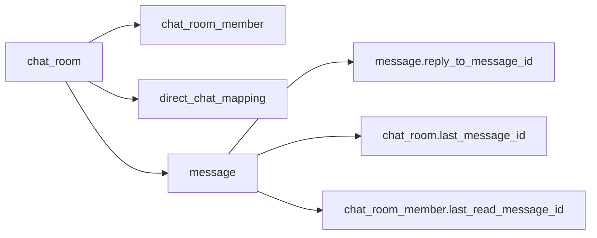

---
tags:
  - pabal
  - architecture
  - database
  - flyway
  - persistence
---

# Pabal 데이터베이스 스키마와 제약

> 상위 문서: [Pabal Wiki Home](../README.md)
> 관련 문서: [Pabal Persistence 경계와 데이터 변환](persistence-boundary-and-mapping.md), [Pabal 로컬 개발과 런타임 구성](local-runtime.md), [Pabal 도메인 모델 상세](../domain/messenger-domain-model.md), [Pabal Command-Query 유스케이스 카탈로그](../use-cases/command-query-catalog.md), [Pabal 테스트 전략](../testing/testing-strategy.md)

## 개요

Layer: App / Infrastructure / Contract
Status: Implemented

Pabal Messenger의 DB schema source of truth는 Flyway migration이다. Hibernate는 schema 생성이 아니라 `ddl-auto: validate`로 정합성 검증만 담당한다.

현재 migration 파일은 `pabal-app/src/main/resources/db/migration`에 있다.

- `V1__postgres_extensions_and_uuidv7.sql`
- `V2__messenger_tables.sql`

## Schema 관리 원칙

Layer: App / Infrastructure

- DB table, index, unique/check/FK constraint는 Flyway가 관리한다.
- JPA Entity는 mapping과 runtime persistence adapter 책임을 가진다.
- DB constraint는 동시성 race condition의 최종 방어선이다.
- 모든 주요 FK/unique constraint는 `tenant_id`를 포함해 tenant 간 데이터 오염을 방지한다.
- Java/JPA는 `UuidV7IdGenerator`를 기본 ID 생성 경로로 사용하고, DB `uuidv7()`는 수동 SQL/운영 보정/테스트 데이터의 fallback이다.

## 테이블 관계



## 테이블별 책임

| Table | 대상 Entity | 주요 책임 |
| --- | --- | --- |
| `chat_room` | `ChatRoomEntity` | DIRECT/GROUP/CHANNEL 공통 메타데이터, room 상태, last message snapshot |
| `chat_room_member` | `ChatRoomMemberEntity` | room membership, active/left 상태, read cursor |
| `direct_chat_mapping` | `DirectChatMappingEntity` | direct participant pair와 room 매핑 |
| `message` | `MessageEntity` | room-local sequence 기반 메시지 저장, reply, idempotency |

## 핵심 제약

### chat_room

Layer: Infrastructure / Domain

- `uq_chat_room_tenant_id_id`: tenant 포함 room 식별 FK target
- `chk_chat_room_type`: `DIRECT`, `GROUP`, `CHANNEL`
- `chk_chat_room_status`: `ACTIVE`, `PENDING_DELETION`, `DELETED`
- `chk_chat_room_channel_requires_workspace`: channel은 `workspace_id` 필수
- `chk_chat_room_channel_requires_name`: channel은 `name` 필수
- `chk_chat_room_direct_name_absent`: direct room은 `name` 없음
- `chk_chat_room_deleted_consistency`: `DELETED`와 `deleted_at` 정합성
- `uq_chat_room_channel_name_alive`: 같은 tenant/workspace의 살아있는 channel 이름을 `lower(name)` 기준으로 unique 보장

### chat_room_member

Layer: Infrastructure / Domain

- `fk_chat_room_member_room`: tenant + room FK
- `uq_chat_room_member`: tenant + room + user 중복 membership 방지
- `chk_chat_room_member_last_read_sequence_non_negative`: read cursor 음수 방지
- `chk_chat_room_member_left_after_join`: `left_at >= joined_at`
- `idx_chat_room_member_user_active`: 내 active room 목록 조회
- `idx_chat_room_member_room_active`: room active member 조회

### direct_chat_mapping

Layer: Infrastructure / Domain

- `fk_direct_chat_mapping_room`: tenant + room FK
- `uq_direct_chat_mapping`: tenant + sorted user pair 중복 direct room 방지
- `uq_direct_chat_mapping_room`: room 하나당 direct mapping 하나
- `chk_direct_chat_mapping_distinct_users`: 자기 자신과 direct room 생성 방지
- `chk_direct_chat_mapping_user_order`: `user_id_min < user_id_max`

### message

Layer: Infrastructure / Domain

- `fk_message_room`: tenant + room FK
- `fk_message_reply_to`: 같은 tenant + 같은 room의 message만 reply target 허용
- `uq_message_tenant_room_id`: reply/last-read FK target
- `uq_message_client_id`: tenant + room + sender + clientMessageId idempotency
- `uq_message_room_sequence`: room-local sequence uniqueness
- `chk_message_type`: `USER`, `SYSTEM`
- `chk_message_status`: `ACTIVE`, `DELETED`, `EDITED`
- `chk_message_content_length`: `char_length(content) BETWEEN 1 AND 5000`
- `chk_message_sequence_positive`: sequence는 1 이상
- `chk_message_deleted_consistency`: `DELETED`와 `deleted_at` 정합성

## 메시지 길이 정책

Status: Implemented
Layer: API / Domain / Infrastructure

현재 메시지 본문 길이 정책은 API, Domain, DB에서 5000자로 정렬되어 있다.

| 위치 | 현재 기준 |
| --- | --- |
| `SendMessageRequest.content` | `@Size(max = 5000)` |
| `SendReplyRequest.content` | `@Size(max = 5000)` |
| `EditMessageRequest.newContent` | `@Size(max = 5000)` |
| `MessageContent` | `MAX_LENGTH = 5000` |
| Flyway `message.content` | `TEXT NOT NULL` + `chk_message_content_length` |

이 정책은 회귀 테스트로 보호해야 한다. 관련 테스트 위치는 [Pabal 테스트 전략](../testing/testing-strategy.md)과 [Pabal 테스트 케이스 카탈로그](../testing/test-case-catalog.md)를 기준으로 정한다.

## Idempotency와 constraint translation

Layer: Application / Infrastructure

메시지 전송은 application에서 중복 메시지를 먼저 조회하고, DB unique constraint를 최종 방어선으로 둔다.

```text
SendMessageCommandHandler
→ MessageSendSupport.findDuplicate
→ MessageSendSupportAdapter.send
→ MessageWriteRepositoryImpl.append
→ uq_message_client_id 위반 시 DuplicateMessageException 번역
```

`MessageWriteRepositoryImpl`은 `uq_message_client_id` constraint name을 확인해 `DuplicateMessageException`으로 변환한다. 그 외 `DataIntegrityViolationException`은 공통 오류 처리에서 conflict 응답으로 정규화된다.

## Schema 변경 체크리스트

- [ ] Domain invariant가 바뀌는가?
- [ ] API validation과 DB check constraint가 같은 정책을 갖는가?
- [ ] JPA Entity column/mapping이 migration과 일치하는가?
- [ ] `State`/`Persisted*` record에 새 필드가 필요한가?
- [ ] read/write repository query에 tenant 조건이 유지되는가?
- [ ] unique constraint 위반을 domain exception으로 번역해야 하는가?
- [ ] Flyway migration 추가 후 `ddl-auto: validate`가 통과하는가?
- [ ] 관련 문서 [Pabal Persistence 경계와 데이터 변환](persistence-boundary-and-mapping.md)을 갱신했는가?
