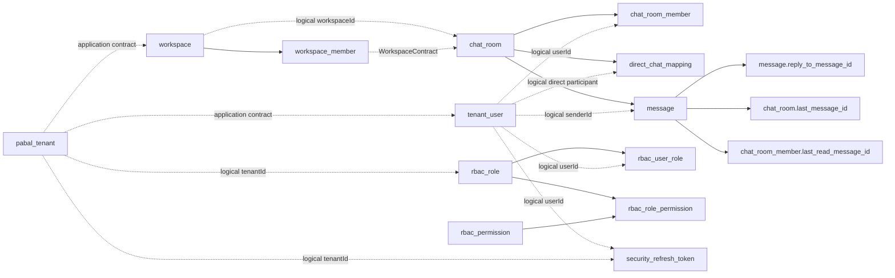

---
tags:
  - pabal
  - architecture
  - database
  - flyway
  - persistence
---

# Pabal 데이터베이스 스키마와 제약

> 상위 문서: [Pabal Wiki Home](../README.md)
> 관련 문서: [Pabal Persistence 경계와 데이터 변환](persistence-boundary-and-mapping.md), [Pabal 로컬 개발과 런타임 구성](local-runtime.md), [Pabal 도메인 모델 상세](../domain/messenger-domain-model.md), [Pabal Command-Query 유스케이스 카탈로그](../use-cases/command-query-catalog.md), [Pabal 테스트 전략](../testing/testing-strategy.md)

## 개요

Layer: App / Infrastructure / Contract
Status: Implemented

Pabal DB schema source of truth는 Flyway migration이다. Hibernate는 schema 생성이 아니라 `ddl-auto: validate`로 정합성 검증만 담당한다.

현재 migration 파일은 `pabal-app/src/main/resources/db/migration`에 있다.

- `V1__postgres_extensions_and_uuidv7.sql`
- `V2__messenger_tables.sql`
- `V3__tombstone_deleted_message_content.sql`
- `V4__tenant_user_tables.sql`
- `V5__tenant_tables.sql`
- `V6__workspace_tables.sql`
- `V7__tenant_registration_tables.sql`
- `V8__authorization_rbac_tables.sql`
- `V9__security_refresh_tokens.sql`

## Schema 관리 원칙

Layer: App / Infrastructure

- DB table, index, unique/check/FK constraint는 Flyway가 관리한다.
- JPA Entity는 mapping과 runtime persistence adapter 책임을 가진다.
- DB constraint는 동시성 race condition의 최종 방어선이다.
- 모든 주요 FK/unique constraint는 `tenant_id`를 포함해 tenant 간 데이터 오염을 방지한다.
- Java/JPA는 `UuidV7IdGenerator`를 기본 ID 생성 경로로 사용하고, DB `uuidv7()`는 수동 SQL/운영 보정/테스트 데이터의 fallback이다.

## 테이블 관계


```mermaid
flowchart LR
    tenant["pabal_tenant"]
    workspace["workspace"] --> workspace_member["workspace_member"]
    user["tenant_user"]
    room["chat_room"] --> member["chat_room_member"]
    room --> mapping["direct_chat_mapping"]
    room --> message["message"]
    message --> reply["message.reply_to_message_id"]
    message --> last["chat_room.last_message_id"]
    message --> read["chat_room_member.last_read_message_id"]
    tenant -. "application contract" .-> user
    tenant -. "application contract" .-> workspace
    workspace -. "logical workspaceId" .-> room
    workspace_member -. "WorkspaceContract" .-> room
    user -. "logical userId" .-> member
    user -. "logical senderId" .-> message
    user -. "logical direct participant" .-> mapping
    role["rbac_role"] --> user_role["rbac_user_role"]
    role --> role_permission["rbac_role_permission"]
    permission["rbac_permission"] --> role_permission
    user -. "logical userId" .-> user_role
    tenant -. "logical tenantId" .-> role
    refresh["security_refresh_token"]
    user -. "logical userId" .-> refresh
    tenant -. "logical tenantId" .-> refresh
```

## 테이블별 책임

| Table | 대상 Entity | 주요 책임 |
| --- | --- | --- |
| `pabal_tenant` | `TenantEntity` | tenant 존재/상태/name 저장, tenant module source of truth |
| `workspace` | `WorkspaceEntity` | tenant 안의 workspace 존재/상태/name/creator 저장 |
| `workspace_member` | `WorkspaceMemberEntity` | workspace membership, role, active/left 상태 저장 |
| `tenant_user` | `TenantUserEntity` | tenant 안의 사용자 존재/상태/name 저장, user module source of truth |
| `tenant_registration` | `TenantRegistrationEntity` | tenant onboarding 등록 요청/DNS 검증/활성화/재검증 상태 저장 (Status: Implemented) |
| `rbac_permission` | n/a | cross-cutting fine-grained permission catalog |
| `rbac_role` | n/a | tenant-scoped RBAC role bundle |
| `rbac_role_permission` | n/a | role과 permission catalog row 연결 |
| `rbac_user_role` | n/a | tenant user와 RBAC role assignment 연결 |
| `security_refresh_token` | n/a | opaque refresh token hash, rotation, revocation 저장 |
| `chat_room` | `ChatRoomEntity` | DIRECT/GROUP/CHANNEL 공통 메타데이터, room 상태, last message snapshot |
| `chat_room_member` | `ChatRoomMemberEntity` | room membership, active/left 상태, read cursor |
| `direct_chat_mapping` | `DirectChatMappingEntity` | direct participant pair와 room 매핑 |
| `message` | `MessageEntity` | room-local sequence 기반 메시지 저장, reply, idempotency |

## 핵심 제약

### pabal_tenant

Layer: Infrastructure / Domain

- `chk_pabal_tenant_status`: `ACTIVE`, `SUSPENDED`, `DELETED`
- `chk_pabal_tenant_name_not_blank`: 공백 name 방지
- `idx_pabal_tenant_status`: active tenant 존재 확인 조회

`tenant_user.tenant_id`, `workspace.tenant_id`, messenger table의 `tenant_id`는 같은 tenant identity 값을 사용한다. User/Workspace/Messenger bounded context가 `pabal_tenant`를 직접 DB FK로 묶지는 않고, application contract인 `TenantContract`에서 active tenant 여부를 검증한다.

### workspace

Layer: Infrastructure / Domain

- `uq_workspace_tenant_id_id`: tenant 포함 workspace 식별 FK target
- `chk_workspace_status`: `ACTIVE`, `ARCHIVED`
- `chk_workspace_name_not_blank`: 공백 name 방지
- `idx_workspace_tenant_status`: tenant별 active workspace 조회

`chat_room.workspace_id`는 workspace identity 값을 사용하지만 messenger table에서 `workspace`로 직접 FK를 두지 않는다. Messenger는 workspace membership 검증이 필요한 channel participant validation에서 `WorkspaceContract`를 사용한다.

### workspace_member

Layer: Infrastructure / Domain

- `uq_workspace_member_tenant_workspace_user`: tenant + workspace + user 중복 membership 방지
- `fk_workspace_member_workspace`: tenant + workspace FK
- `chk_workspace_member_role`: `OWNER`, `ADMIN`, `MEMBER`
- `chk_workspace_member_status`: `ACTIVE`, `LEFT`
- `chk_workspace_member_left_at`: `ACTIVE`/`LEFT`와 `left_at` 정합성
- `idx_workspace_member_active_lookup`: tenant/workspace/user/status 기반 membership 조회

`workspace_member.user_id`는 `tenant_user.id`와 같은 identity 값을 사용하지만 DB FK를 두지 않는다. Workspace 생성과 membership 검증은 `UserContract`와 `WorkspaceContract`로 active tenant user 여부를 확인한다.

### tenant_user

Layer: Infrastructure / Domain

- `uq_tenant_user_tenant_id_id`: tenant 포함 user 식별 target
- `chk_tenant_user_status`: `ACTIVE`, `DISABLED`
- `chk_tenant_user_name_not_blank`: 공백 name 방지
- `idx_tenant_user_tenant_status`: tenant별 active user 조회

`chat_room_member.user_id`, `message.sender_id`, `direct_chat_mapping.user_id_min/user_id_max`는 `tenant_user.id`와 같은 identity 값을 사용하지만 DB FK를 두지 않는다. Messenger와 User bounded context의 결합은 DB FK가 아니라 application contract인 `UserContract`와 `RoomParticipantPolicy`에서 검증한다. User 생성은 `TenantContract`로 active tenant 여부를 먼저 검증한다.

### tenant_registration

Layer: Infrastructure / Domain
Status: Implemented

`V7__tenant_registration_tables.sql`이 현재 tenant registration schema를 테이블 단위로 정의한다:

- `chk_tenant_registration_status`: `PENDING_VERIFICATION`, `DOMAIN_VERIFIED`, `REVERIFICATION_REQUIRED`, `ACTIVATED`, `EXPIRED` (5-status)
- `verification_expires_at timestamptz NOT NULL`: `PENDING_VERIFICATION`의 검증 마감 시각
- `activation_expires_at timestamptz` (nullable): `DOMAIN_VERIFIED`/`REVERIFICATION_REQUIRED`/`ACTIVATED`의 활성화 마감 시각
- `chk_tenant_registration_verification_expires_after_created`: `verification_expires_at > created_at`
- `chk_tenant_registration_status_timestamps`: status별 `activation_expires_at`/`verified_at`/`activated_at`/`tenant_id` 정합성
  - `PENDING_VERIFICATION`: `activation_expires_at IS NULL AND verified_at IS NULL AND activated_at IS NULL AND tenant_id IS NULL`
  - `DOMAIN_VERIFIED` / `REVERIFICATION_REQUIRED`: `activation_expires_at IS NOT NULL AND verified_at IS NOT NULL AND activated_at IS NULL AND tenant_id IS NULL`
  - `ACTIVATED`: `activation_expires_at IS NOT NULL AND verified_at IS NOT NULL AND activated_at IS NOT NULL AND tenant_id IS NOT NULL`
  - `EXPIRED`: `activated_at IS NULL AND tenant_id IS NULL`
- `uq_tenant_registration_domain_open`: `PENDING_VERIFICATION`/`DOMAIN_VERIFIED`/`REVERIFICATION_REQUIRED`/`ACTIVATED`(= domain `isOpen()`과 동일한 4개 open status) 상태의 domain 중복 방지
- `idx_tenant_registration_status_verification_expires`: status + `verification_expires_at` 조회 (`expirePendingRegistrations`/`findPendingVerificationIds`가 사용)
- `idx_tenant_registration_status_activation_expires` (partial, `WHERE activation_expires_at IS NOT NULL`): status + `activation_expires_at` 조회 (reverification sweep의 `findLapsedDomainVerifiedIds`가 사용)

**persistence 계층은 domain/contract와 정합한다**: `TenantRegistrationEntity`는 새 `TenantRegistrationState` 13-arg 생성자 순서에 맞춰 `verificationExpiresAt`/`activationExpiresAt` 두 필드를 모두 매핑하고, `TenantRegistrationRepositoryImpl.OPEN_STATUSES`는 `DOMAIN_VERIFIED`/`REVERIFICATION_REQUIRED`를 포함한 4개 open status를 사용한다. `TenantRegistrationExpirationScheduler.reverifyLapsedRegistrations()`가 lapsed `DOMAIN_VERIFIED` registration을 도메인 메서드 `requireReverification(now)`를 통해서만 `REVERIFICATION_REQUIRED`로 전이하는 sweep을 실행한다(bulk `UPDATE`가 아니다). `expirePendingRegistrations`는 `verification_expires_at` 기준으로 `PENDING_VERIFICATION`만 `EXPIRED`로 닫으며 `DOMAIN_VERIFIED`/`REVERIFICATION_REQUIRED`는 건드리지 않는다.

**grace-window terminal expiry**: `TenantRegistrationRepository.expireLapsedReverificationRegistrations(Instant now, long graceMs)`는 `activation_expires_at <= now - graceMs`인 `REVERIFICATION_REQUIRED` row를 bulk `UPDATE`로 `EXPIRED`로 닫는다(`expirePendingRegistrations`와 동일한 bulk-UPDATE 패턴). 이 경로로 `EXPIRED`가 된 row는 `verified_at`/`activation_expires_at`을 그대로 유지하고 `activated_at`/`tenant_id`만 null인 채 남는데, 이는 위 `chk_tenant_registration_status_timestamps`의 `EXPIRED` 분기(`activated_at IS NULL AND tenant_id IS NULL`)가 이미 허용하는 형태라 스키마 변경 없이 수행된다. grace window 길이는 `pabal.tenant.registration.reverification-grace-ms`(기본 604800000ms = 7일)이며, `TenantRegistrationExpirationScheduler.expirePendingRegistrations()`가 기존 pending expiry sweep과 함께 호출한다. `DOMAIN_VERIFIED` row는 이 sweep이 건드리지 않는다 — 먼저 `reverifyLapsedRegistrations()`로 `REVERIFICATION_REQUIRED`를 거쳐야 한다.

**application/api 계층도 domain/contract와 정합한다**: `pabal-tenant-application`의 `VerifyTenantDomainCommandHandler`는 verify-only handler로 재작성되어 DNS 검증 후 `DOMAIN_VERIFIED`에서 멈추고 `Tenant`를 생성하지 않는다. 별도 `ActivateTenantRegistrationCommandHandler`/`ReverifyTenantRegistrationCommandHandler`가 각각 activation과 단일-registration reverification을 담당한다. `pabal-tenant-api`는 `POST /api/v1/tenant-registrations/{registrationId}/activation`, `POST /api/v1/tenant-registrations/{registrationId}/reverification` endpoint를 노출하며, 모든 응답 DTO가 단일 `expiresAt` 대신 `verificationExpiresAt`/`activationExpiresAt`을 노출한다. 배경은 [ADR-0013](../adr/0013-split-overloaded-expiry-timestamp-into-verification-and-activation-windows.md)과 [Pabal 기술 부채와 보강 목록](technical-debt.md#10-tenantregistration-domain-verificationactivation-분리와-persistenceapplicationapi-반영-해소됨)을 참고한다.

### rbac_permission

Layer: Security / App

- `uq_rbac_permission_resource_action_scope`: resource/action/scope 중복 방지
- `uq_rbac_permission_value`: `{context}:{resource}:{action}` permission value 중복 방지
- `chk_rbac_permission_*_not_blank`: resource/action/scope/value 공백 방지

`rbac_permission`은 각 bounded context application module의 `FineGrainedPermission` enum과 맞춰 관리한다. 현재 seed catalog는 `TenantPermission`, `UserPermission`, `WorkspacePermission`, `MessengerPermission` 값을 포함한다.

### rbac_role

Layer: Security / App

- `uq_rbac_role_tenant_name`: tenant 안의 role name 중복 방지
- `uq_rbac_role_tenant_id_id`: tenant 포함 role FK target
- `chk_rbac_role_status`: `ACTIVE`, `DISABLED`
- `chk_rbac_role_name_not_blank`: 공백 role name 방지
- `idx_rbac_role_tenant_status`: tenant별 active role 조회

`rbac_role.tenant_id`는 tenant identity 값을 사용하지만 `pabal_tenant`로 직접 FK를 두지 않는다. Tenant 존재/상태 검증은 tenant module contract 또는 bootstrap/admin use case에서 수행한다.

### rbac_role_permission

Layer: Security / App

- `pk_rbac_role_permission`: tenant + role + permission 중복 연결 방지
- `fk_rbac_role_permission_role`: tenant 포함 role FK
- `fk_rbac_role_permission_permission`: permission catalog FK
- `idx_rbac_role_permission_role`: role permission 조회

Wildcard role은 DB에 저장하지 않는다. role template 문서에서 `workspace:*`처럼 표현하더라도 DB에는 concrete `rbac_permission.value` row를 연결한다.

### rbac_user_role

Layer: Security / App

- `pk_rbac_user_role`: tenant + user + role 중복 assignment 방지
- `fk_rbac_user_role_role`: tenant 포함 role FK
- `chk_rbac_user_role_revoked_after_assigned`: revoke 시각 정합성
- `idx_rbac_user_role_lookup`: active assignment 조회

`rbac_user_role.user_id`는 `tenant_user.id`와 같은 identity 값을 사용하지만 DB FK를 두지 않는다. User 존재/상태 검증은 user module contract 또는 admin use case에서 수행한다.

### security_refresh_token

Layer: Security / App

- `uq_security_refresh_token_hash`: refresh token hash 중복 방지
- `fk_security_refresh_token_replacement`: refresh token rotation chain
- `chk_security_refresh_token_hash_not_blank`: token hash 공백 방지
- `chk_security_refresh_token_subject_not_blank`: subject 공백 방지
- `chk_security_refresh_token_authority_claims_not_blank`: authority snapshot 공백 방지
- `chk_security_refresh_token_expires_after_issued`: 만료 시각 정합성
- `chk_security_refresh_token_used_after_issued`: refresh 사용 시각 정합성
- `chk_security_refresh_token_revoked_after_issued`: revoke 시각 정합성
- `idx_security_refresh_token_active_hash`: refresh token 검증 조회
- `idx_security_refresh_token_user_active`: user 전체 token revoke 조회

DB에는 refresh token 원문을 저장하지 않고 SHA-256 hash만 저장한다. refresh 성공 시 새 row를 만들고 기존 row의 `used_at`, `revoked_at`, `replaced_by_token_id`를 채워 rotate한다. `used_at`은 3초 grace period 안의 중복 refresh 요청을 UX 관점에서 replay할 수 있는 시간 기준이고, 실제 token pair 재반환 값은 30초 TTL의 Redis replay cache가 보관한다.

### chat_room

Layer: Infrastructure / Domain

- `uq_chat_room_tenant_id_id`: tenant 포함 room 식별 FK target
- `chk_chat_room_type`: `DIRECT`, `GROUP`, `CHANNEL`
- `chk_chat_room_status`: `ACTIVE`, `PENDING_DELETION`, `DELETED`
- `chk_chat_room_channel_requires_workspace`: channel은 `workspace_id` 필수
- `chk_chat_room_channel_requires_name`: channel은 `name` 필수
- `chk_chat_room_direct_name_absent`: direct room은 `name` 없음
- `chk_chat_room_deleted_consistency`: `DELETED`와 `deleted_at` 정합성
- `uq_chat_room_channel_name_alive`: 같은 tenant/workspace의 살아있는 channel 이름을 `lower(name)` 기준으로 unique 보장

### chat_room_member

Layer: Infrastructure / Domain

- `fk_chat_room_member_room`: tenant + room FK
- `uq_chat_room_member`: tenant + room + user 중복 membership 방지
- `chk_chat_room_member_last_read_sequence_non_negative`: read cursor 음수 방지
- `chk_chat_room_member_left_after_join`: `left_at >= joined_at`
- `idx_chat_room_member_user_active`: 내 active room 목록 조회
- `idx_chat_room_member_room_active`: room active member 조회

### direct_chat_mapping

Layer: Infrastructure / Domain

- `fk_direct_chat_mapping_room`: tenant + room FK
- `uq_direct_chat_mapping`: tenant + sorted user pair 중복 direct room 방지
- `uq_direct_chat_mapping_room`: room 하나당 direct mapping 하나
- `chk_direct_chat_mapping_distinct_users`: 자기 자신과 direct room 생성 방지
- `chk_direct_chat_mapping_user_order`: `user_id_min < user_id_max`

### message

Layer: Infrastructure / Domain

- `fk_message_room`: tenant + room FK
- `fk_message_reply_to`: 같은 tenant + 같은 room의 message만 reply target 허용
- `uq_message_tenant_room_id`: reply/last-read FK target
- `uq_message_client_id`: tenant + room + sender + clientMessageId idempotency
- `uq_message_room_sequence`: room-local sequence uniqueness
- `chk_message_type`: `USER`, `SYSTEM`
- `chk_message_status`: `ACTIVE`, `DELETED`, `EDITED`
- `chk_message_content_length`: `char_length(content) BETWEEN 1 AND 5000`
- `chk_message_sequence_positive`: sequence는 1 이상
- `chk_message_deleted_consistency`: `DELETED`와 `deleted_at` 정합성
- `V3__tombstone_deleted_message_content`: 기존 `DELETED` message content를 `[deleted]`로 보정

## 메시지 길이 정책

Status: Implemented
Layer: API / Domain / Infrastructure

현재 메시지 본문 길이 정책은 API, Domain, DB에서 5000자로 정렬되어 있다.

| 위치 | 현재 기준 |
| --- | --- |
| `SendMessageRequest.content` | `@Size(max = 5000)` |
| `SendReplyRequest.content` | `@Size(max = 5000)` |
| `EditMessageRequest.newContent` | `@Size(max = 5000)` |
| `MessageContent` | `MAX_LENGTH = 5000` |
| Flyway `message.content` | `TEXT NOT NULL` + `chk_message_content_length` |

이 정책은 회귀 테스트로 보호해야 한다. 관련 테스트 위치는 [Pabal 테스트 전략](../testing/testing-strategy.md)과 [Pabal 테스트 케이스 카탈로그](../testing/test-case-catalog.md)를 기준으로 정한다.

## Idempotency와 constraint translation

Layer: Application / Infrastructure

메시지 전송은 application에서 중복 메시지를 먼저 조회하고, DB unique constraint를 최종 방어선으로 둔다.

```text
SendMessageCommandHandler
→ MessageSendSupport.findDuplicate
→ MessageSendSupportAdapter.send
→ MessageWriteRepositoryImpl.append
→ uq_message_client_id 위반 시 DuplicateMessageException 번역
```

`MessageWriteRepositoryImpl`은 `uq_message_client_id` constraint name을 확인해 `DuplicateMessageException`으로 변환한다. 그 외 `DataIntegrityViolationException`은 공통 오류 처리에서 conflict 응답으로 정규화된다.

## Schema 변경 체크리스트

- [ ] Domain invariant가 바뀌는가?
- [ ] API validation과 DB check constraint가 같은 정책을 갖는가?
- [ ] JPA Entity column/mapping이 migration과 일치하는가?
- [ ] `State`/`Persisted*` record에 새 필드가 필요한가?
- [ ] read/write repository query에 tenant 조건이 유지되는가?
- [ ] unique constraint 위반을 domain exception으로 번역해야 하는가?
- [ ] Flyway migration 추가 후 `ddl-auto: validate`가 통과하는가?
- [ ] 관련 문서 [Pabal Persistence 경계와 데이터 변환](persistence-boundary-and-mapping.md)을 갱신했는가?
