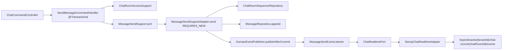

---
tags:
  - pabal
  - architecture
  - event
  - transaction
  - realtime
---

# Pabal 이벤트 발행과 트랜잭션 경계

> 상위 문서: [Pabal 상세 설계 허브](../design/design-hub.md)
> 관련 문서: [Pabal 런타임 흐름](runtime-flow.md), [Pabal 공통 모듈 설계](common-module-design.md), [Pabal Realtime 이벤트 스키마](../realtime/event-schema.md), [Pabal STOMP 연동 가이드](../realtime/stomp-guide.md), [Pabal MSA 전환 준비 체크리스트](msa-readiness-checklist.md), [Pabal 테스트 전략](../testing/testing-strategy.md)

## 개요

Layer: Common → Application → Infrastructure
Status: Implemented

현재 Pabal의 domain event는 같은 애플리케이션 프로세스 안에서 Spring application event로 발행된다. 외부 broker나 outbox 기반 durable event delivery는 아직 구현되어 있지 않다.

현재 기준:

- `DomainEventPublisher`: common layer abstraction
- `SpringDomainEventPublisher`: Spring 기반 구현
- application command/service: transaction 안에서 domain event 발행 예약
- `MessageSendSupport`: application interface
- `MessageSendSupportAdapter`: infrastructure adapter, message send transaction owner
- application event listener: event를 realtime payload로 변환
- `ChatRealtimePort`: application outbound port
- `StompChatRealtimeAdapter`: STOMP 전송 adapter

## 발행 방식

Layer: Common

`SpringDomainEventPublisher`는 두 API를 가진다.

| Method | Status | 용도 |
| --- | --- | --- |
| `publishNow` | Implemented | transaction commit을 기다리지 않고 즉시 Spring event 발행 |
| `publishAfterCommit` | Implemented | 실제 transaction commit 이후 Spring event 발행 |

`publishAfterCommit`은 다음 조건을 만족하지 않으면 실패한다.

```text
TransactionSynchronizationManager.isSynchronizationActive()
TransactionSynchronizationManager.isActualTransactionActive()
```

조건이 맞지 않으면 `IllegalStateException("Actual active transaction required for publishAfterCommit")`을 던진다.

## 메시지 전송 이벤트 흐름

Layer: API → Application → Domain → Application Port → Infrastructure Adapter



코드 흐름:

```text
SendMessageCommandHandler.handle
→ MessageSendSupport.findDuplicate
→ Message.create
→ MessageSendSupportAdapter.send
→ ChatRoomSequenceRepository.allocateNextMessageSequence
→ MessageRepository.append
→ ChatRoomSequenceRepository.updateLastMessageSnapshot
→ DomainEventPublisher.publishAfterCommit(MessageSentEvent)
→ MessageSentEventListener.handle
→ ChatRealtimePort.publishRoomEvent
→ StompChatRealtimeAdapter
```

`MessageSendSupport`는 application boundary의 interface다. 실제 구현인 infrastructure `MessageSendSupportAdapter.send`가 `@Transactional(propagation = Propagation.REQUIRES_NEW)`를 사용한다. 따라서 message sequence 할당, message 저장, last message snapshot 갱신, after-commit event 등록은 이 transaction 경계 안에서 묶인다.

## 이벤트와 listener 매핑

Layer: Domain / Application / Contract / Infrastructure

| Domain Event | Listener | Realtime Type | Payload |
| --- | --- | --- | --- |
| `MessageSentEvent` | `MessageSentEventListener` | `MESSAGE_SENT` | `MessageSentRealtimePayload` |
| `MessageEditedEvent` | `MessageEditedEventListener` | `MESSAGE_EDITED` | `MessageEditedRealtimePayload` |
| `MessageDeletedEvent` | `MessageDeletedEventListener` | `MESSAGE_DELETED` | `MessageDeletedRealtimePayload` |
| `MessageReadEvent` | `MessageReadEventListener` | `MESSAGE_READ` | `MessageReadRealtimePayload` |
| `MemberJoinedEvent` | `MemberJoinedEventListener` | `MEMBER_JOINED` | `MemberJoinedRealtimePayload` |
| `MemberLeftEvent` | `MemberLeftEventListener` | `MEMBER_LEFT` | `MemberLeftRealtimePayload` |

이벤트 schema는 [Pabal Realtime 이벤트 스키마](../realtime/event-schema.md)를 기준으로 관리한다.

## Listener 책임

Layer: Application

Application listener는 다음을 담당한다.

- event에 들어 있는 ID로 최신 persistence state를 조회한다.
- contract realtime payload를 만든다.
- `RoomEventEnvelope`로 감싼다.
- `ChatRealtimePort`를 호출한다.

Listener는 STOMP destination 문자열을 직접 만들지 않는다. destination 세부사항은 infrastructure의 `ChatRealtimeDestinations`와 `StompChatRealtimeAdapter`에 둔다.

## Transaction 경계에서 주의할 점

- `publishAfterCommit`은 transaction 밖에서 호출하면 실패한다.
- 이벤트 listener는 commit 이후 실행되므로, listener 내부 조회는 DB에 commit된 상태를 기준으로 한다.
- listener에서 예외가 발생해도 이미 commit된 command transaction을 되돌릴 수 없다.
- 현재 방식은 in-process event이므로 프로세스 종료/장애 시 durable 재전송을 보장하지 않는다.
- 외부 client contract를 바꾸는 payload 변경은 [Pabal Realtime 이벤트 스키마](../realtime/event-schema.md)와 [Pabal STOMP 연동 가이드](../realtime/stomp-guide.md)를 같이 갱신해야 한다.

## 현재 방식의 한계와 MSA 전환 조건

Status: Planned

현재 이벤트는 같은 애플리케이션 프로세스 안에서만 의미가 있다. 다음 조건이 생기면 outbox 또는 외부 broker 기반 event contract를 검토한다.

- realtime event 손실 허용 범위가 낮아진다.
- notification, audit, search projection 같은 추가 consumer가 늘어난다.
- Messenger를 독립 서비스로 분리한다.
- 이벤트 재처리, 중복 처리, delivery guarantee가 요구된다.

MSA 전환 관점은 [Pabal MSA 전환 준비 체크리스트](msa-readiness-checklist.md)에서 별도로 관리한다.

## 테스트 기준

Layer: Testing

- `SpringDomainEventPublisherIntegrationTest`: after-commit 발행 조건 검증
- application handler test: event publication intent 검증
- realtime adapter test: `ChatRealtimePort` 구현의 destination/payload 검증
- integration test: transaction commit 이후 listener와 adapter wiring 검증

테스트 전략은 [Pabal 테스트 전략](../testing/testing-strategy.md)을 기준으로 확장한다.
