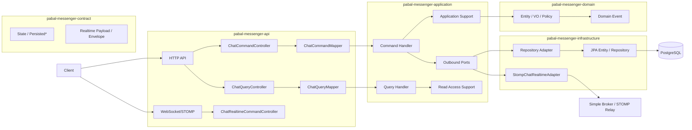

---
tags:
  - pabal
  - architecture
  - overview
---

# Pabal 아키텍처 개요

> 상위 문서: [Pabal Wiki Home](../README.md)
> 관련 문서: [Pabal 패키지 구조와 레이어](package-structure-and-layers.md), [Pabal 멀티모듈 전환 전략](multi-module-transition.md), [Pabal 런타임 흐름](runtime-flow.md), [Pabal 크로스커팅 관심사](cross-cutting-concerns.md), [Pabal Persistence 경계와 데이터 변환](persistence-boundary-and-mapping.md), [Pabal Messenger 온보딩 가이드](../onboarding/messenger-onboarding.md)

## 한 문장 요약

Pabal Messenger는 `messenger` 도메인을 중심으로 **DDD + Hexagonal + CQRS + Realtime(STOMP)**를 결합한 Java 25 / Spring Boot 4.0.2 기반 멀티모듈 모놀리스다.

## 현재 상태

- 현재 상태: 단일 배포 모놀리스
- 구현 상태: 멀티모듈 소스 구조 구현
- 실행 모듈: `pabal-app`
- 전환 목표: 멀티모듈 모놀리스 안정화
- 장기 가능성: MSA 분리 가능성 검토

## 아키텍처에서 먼저 잡아야 할 핵심

1. Layer: Domain
   - 핵심 비즈니스 규칙은 `pabal-messenger-domain`에 둔다.
   - domain은 HTTP, STOMP, JPA, `State`, `Persisted*`를 모른다.
2. Layer: Application
   - command/query handler가 유스케이스를 조립한다.
   - repository/realtime/time outbound port는 `pabal-messenger-application`에 있다.
3. Layer: Contract
   - persistence `State`, `Persisted*`, `PersistenceMapper`와 realtime payload/envelope을 둔다.
4. Layer: Infrastructure
   - JPA repository, JPA entity, STOMP adapter, WebSocket security, clock adapter를 둔다.
5. Layer: API
   - HTTP/STOMP request를 command/query로 변환하고, result/dto를 response로 변환한다.

## 시스템 구성 맵

## 패키지 수준에서 본 책임 분리

- `pabal-common`: 공통 에러 응답, 예외, CQRS marker, event publisher, base persistence, UUID v7
- `pabal-security`: JWT decoder/converter, `PabalPrincipal`, HTTP security, local token
- `pabal-messenger-api`: HTTP/WS 진입점과 프로토콜 매핑
- `pabal-messenger-application`: 유스케이스 orchestration, application service/support, outbound port, event listener
- `pabal-messenger-domain`: 순수 도메인 모델, VO, 정책, 예외, 도메인 이벤트
- `pabal-messenger-contract`: persistence/realtime 경계 모델
- `pabal-messenger-infrastructure`: persistence adapter, JPA entity/repository, STOMP adapter, WebSocket authorization, time adapter
- `pabal-app`: Spring Boot 실행과 resource/migration 조립

## MSA 전환 가능성

현재 Pabal은 MSA가 아니다. 다만 다음 이유로 장기 분리 여지를 남긴다.

- messenger API/application/domain/contract/infrastructure가 모듈로 분리되어 있다.
- 외부로 노출될 수 있는 HTTP/STOMP 계약이 `api`와 `contract.realtime`에 모여 있다.
- persistence 경계가 `State`/`Persisted*`/JPA Entity로 나뉘어 있다.
- JWT claim과 tenant/user context가 명시적으로 command/query에 전파된다.

분리 전 선행 조건은 [Pabal MSA 전환 준비 체크리스트](msa-readiness-checklist.md)에 둔다.

## 이 위키에서 다음으로 볼 문서

- 구조를 모듈 단위로 보려면 [Pabal 패키지 구조와 레이어](package-structure-and-layers.md)
- 멀티모듈 의존 규칙을 보려면 [Pabal 멀티모듈 전환 전략](multi-module-transition.md)
- 요청 흐름을 따라가려면 [Pabal 런타임 흐름](runtime-flow.md)
- 인증/멀티테넌시/예외처리 같은 공통 축은 [Pabal 크로스커팅 관심사](cross-cutting-concerns.md)
- persistence wrapper와 JPA 변환은 [Pabal Persistence 경계와 데이터 변환](persistence-boundary-and-mapping.md)
