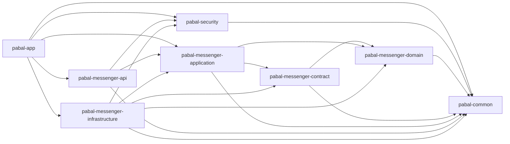

---
tags:
  - pabal
  - architecture
  - package
  - layer
---

# Pabal 패키지 구조와 레이어

> 상위 문서: [Pabal 아키텍처 개요](overview.md)
> 관련 문서: [Pabal 런타임 흐름](runtime-flow.md), [Pabal 크로스커팅 관심사](cross-cutting-concerns.md), [Pabal Persistence 경계와 데이터 변환](persistence-boundary-and-mapping.md), [Pabal 멀티모듈 전환 전략](multi-module-transition.md)

## 현재 모듈 구조

```text
pabal
├─ pabal-app
├─ pabal-common
├─ pabal-security
├─ pabal-messenger-domain
├─ pabal-messenger-contract
├─ pabal-messenger-application
├─ pabal-messenger-api
└─ pabal-messenger-infrastructure
```

현재 상태: 단일 배포 멀티모듈 모놀리스
전환 목표: 모듈 경계를 기준으로 책임과 의존 방향을 고정
장기 가능성: messenger bounded context를 MSA 후보로 분리

## 모듈별 책임

| 모듈 | Layer | 대표 패키지/클래스 | 책임 |
| --- | --- | --- | --- |
| `pabal-app` | App | `PabalApplication`, `application.yaml`, Flyway migration | 실행 애플리케이션, auto configuration 조립, resource 소유 |
| `pabal-common` | Common | `ApiError`, `GlobalExceptionHandler`, `SpringDomainEventPublisher`, `CommandHandler` | 전역 API/error/event/CQRS/UUID v7 공통 규약 |
| `pabal-security` | Security | `PabalJwtAuthenticationConverter`, `PabalPrincipal`, `SecurityConfig`, `LocalJwtConfig` | JWT 인증, principal mapping, HTTP security |
| `pabal-messenger-domain` | Domain | `ChatRoom`, `ChatRoomMember`, `Message`, `DirectChatMapping` | 비즈니스 상태 전이, invariant, domain event, domain exception |
| `pabal-messenger-contract` | Contract | `MessageState`, `PersistedMessage`, `RoomEventEnvelope` | persistence/realtime 경계 shape와 mapper |
| `pabal-messenger-application` | Application | `SendMessageCommandHandler`, `ChatRoomAccessSupport`, `MessageRepository`, `ChatRealtimePort` | command/query orchestration, outbound port, event listener |
| `pabal-messenger-api` | API | `ChatCommandController`, `ChatQueryController`, `ChatRealtimeCommandController` | HTTP/STOMP entrypoint, request/auth mapping, response mapping |
| `pabal-messenger-infrastructure` | Infrastructure | `MessageWriteRepositoryImpl`, `MessageEntity`, `WebSocketBrokerConfig`, `StompChatRealtimeAdapter` | JPA/STOMP/WebSocket/time 구현 |

## 의존 방향



## 허용 의존

- `api → application`
- `api → security/common`
- `application → domain`
- `application → contract`
- `application → common`
- `contract → domain/common`
- `infrastructure → application/domain/contract/security/common`
- `security → common`
- `domain → common`
- `app → api/application/infrastructure/security/common`

## 금지 의존

- `domain → contract`
- `domain → infrastructure`
- `domain → api`
- `application → infrastructure`
- `api → infrastructure`
- `contract → infrastructure`
- `common → messenger-*`
- `security → messenger-*`

## 레이어 규칙 요약

| Layer | 해야 할 일 | 하지 말아야 할 일 |
| --- | --- | --- |
| API | request/auth를 command/query로 변환 | 도메인 규칙 직접 구현 |
| Application | 유스케이스 조립, 트랜잭션, port 호출 | JPA Entity 직접 사용 |
| Domain | 상태 전이, invariant, 정책 | `State`, `Persisted*`, HTTP/STOMP/JPA 의존 |
| Contract | persistence/realtime 경계 shape | 비즈니스 규칙 소유 |
| Infrastructure | DB/WS/security/time 구현 | 유스케이스 정책 결정 |
| Security | 인증과 principal 정규화 | messenger room/member 정책 결정 |
| Common | 전역 공통 규약 제공 | 특정 bounded context 의존 |

## 코드 탐색 기준

- 메시지 전송은 `ChatCommandController`에서 시작해 `SendMessageCommandHandler`, application `MessageSendSupport` port, infrastructure `MessageSendSupportAdapter`로 따라간다.
- room/member 접근 검증은 `ChatRoomAccessSupport`, `ChatRoomReadAccessSupport`를 확인한다.
- repository port는 `pabal-messenger-application/src/main/java/.../port/out/persistence`에 있다.
- adapter 구현체는 `pabal-messenger-infrastructure/src/main/java/.../persistence` 아래에 있다.
- JPA Entity는 `persistence.jpa.entity`, Spring Data repository는 `persistence.jpa.read/write`에 있다.

## 같이 읽으면 좋은 문서

- 멀티모듈 안정화 계획은 [Pabal 멀티모듈 전환 전략](multi-module-transition.md)
- 흐름 중심 설명은 [Pabal 런타임 흐름](runtime-flow.md)
- boundary 모델 설명은 [Pabal Persistence 경계와 데이터 변환](persistence-boundary-and-mapping.md)
- 멀티테넌시/보안/예외처리는 [Pabal 크로스커팅 관심사](cross-cutting-concerns.md)
