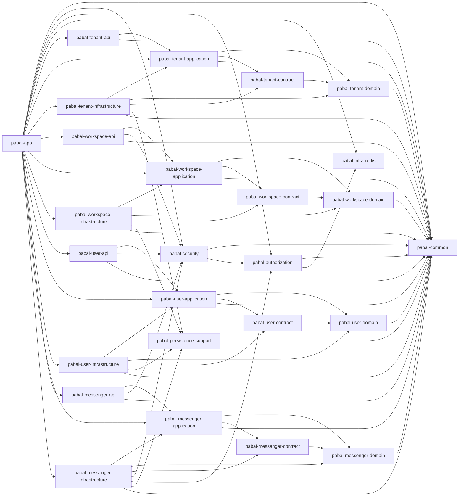

---
tags:
  - pabal
  - architecture
  - package
  - layer
---

# Pabal 패키지 구조와 레이어

> 상위 문서: [Pabal 아키텍처 개요](overview.md)
> 관련 문서: [Pabal 런타임 흐름](runtime-flow.md), [Pabal 크로스커팅 관심사](cross-cutting-concerns.md), [Pabal Authorization Governance와 RBAC Permission 모델](../security/authorization-governance.md), [Pabal Persistence 경계와 데이터 변환](persistence-boundary-and-mapping.md), [Pabal 멀티모듈 전환 전략](multi-module-transition.md)

## 현재 모듈 구조

```text
pabal
├─ buildSrc            # Gradle convention plugin (모듈 아님): pabal.java-conventions, pabal.java-library-conventions
├─ pabal-app
├─ pabal-common
├─ pabal-web
├─ pabal-security
├─ pabal-authorization
├─ pabal-infra-redis
├─ pabal-persistence-support
├─ pabal-tenant-domain
├─ pabal-tenant-contract
├─ pabal-tenant-application
├─ pabal-tenant-api
├─ pabal-tenant-infrastructure
├─ pabal-workspace-domain
├─ pabal-workspace-contract
├─ pabal-workspace-application
├─ pabal-workspace-api
├─ pabal-workspace-infrastructure
├─ pabal-user-domain
├─ pabal-user-contract
├─ pabal-user-application
├─ pabal-user-api
├─ pabal-user-infrastructure
├─ pabal-messenger-domain
├─ pabal-messenger-contract
├─ pabal-messenger-application
├─ pabal-messenger-api
└─ pabal-messenger-infrastructure
```

현재 상태: 단일 배포 멀티모듈 모놀리스
전환 목표: 모듈 경계를 기준으로 책임과 의존 방향을 고정

공유 빌드 관례(Java toolchain, Spring Boot BOM, Lombok, JUnit Platform, Mockito agent,
`-parameters`)는 root `build.gradle.kts`의 `subprojects` 블록이 아니라 `buildSrc`의
convention plugin이 담당한다. 라이브러리 모듈은 `pabal.java-library-conventions`를,
`pabal-app`은 `pabal.java-conventions`를 적용한다. root `build.gradle.kts`에는
cross-project 검증인 `checkProjectDependencyBoundaries`(Gradle 모듈 경계 allowlist 검사,
`check`에 wiring)만 남는다.
장기 가능성: messenger bounded context를 MSA 후보로 분리

## 모듈별 책임

| 모듈 | Layer | 대표 패키지/클래스 | 책임 |
| --- | --- | --- | --- |
| `pabal-app` | App | `PabalApplication`, `application.yaml`, Flyway migration | 실행 애플리케이션, auto configuration 조립, resource 소유 |
| `pabal-common` | Common | `CommandHandler`, `DomainEventPublisher`, `FineGrainedPermission`, `AuthorizationScope`, `TenantContract`, `WorkspaceContract`, `UserContract`, `WorkspaceMemberRole`, `UuidV7` | event/CQRS/UUID v7 primitive, permission abstraction, context 간 최소 contract |
| `pabal-web` | Web Support | `ApiError`, `GlobalExceptionHandler`, `SpringDomainEventPublisher` | 전역 API error response, Spring MVC exception mapping, Spring event publisher 구현 |
| `pabal-security` | Security | `PabalJwtAuthenticationConverter`, `PabalPrincipal`, `CurrentAuthenticationProvider`, `RefreshTokenService`, `JdbcRefreshTokenStore`, `SecurityConfig`, `LocalJwtConfig` | JWT 인증, principal/context mapping, access/refresh token lifecycle, HTTP security |
| `pabal-authorization` | Authorization | `AuthorityNormalizer`, `PermissionAuthorityMatcher`, `RbacPermissionStore`, `JdbcRbacPermissionStore` | authority normalization/matching, RBAC permission 조회/cache, persisted authorization policy access |
| `pabal-infra-redis` | Shared Infrastructure | Spring Data Redis starter dependencies | Redis 기반 cache/pub-sub adapter가 공통으로 사용할 Redis infrastructure dependency 집약 |
| `pabal-persistence-support` | Shared Infrastructure Support | `BaseEntity`, `UpdatableEntity`, `DeletableEntity`, `UuidV7Generated`, `UuidV7IdGenerator` | JPA entity base field와 UUID v7 Hibernate generator |
| `pabal-tenant-domain` | Domain | `Tenant`, `TenantRegistration`, `TenantName`, `TenantRegistrationStatus` | tenant 상태, tenant registration 상태/verification invariant, tenant domain exception |
| `pabal-tenant-contract` | Contract | `TenantState`, `TenantRegistrationState`, `PersistedTenant`, `PersistedTenantRegistration`, `TenantRegistrationPersistenceMapper` | tenant/tenant registration persistence 경계 shape와 mapper |
| `pabal-tenant-application` | Application | `RequestTenantRegistrationCommandHandler`, `VerifyTenantDomainCommandHandler`, `CreateTenantCommandHandler`, `TenantContractService` | tenant registration orchestration, dev seed command/query, repository port, 공통 `TenantContract` 구현 |
| `pabal-tenant-api` | API | `TenantRegistrationCommandController`, `TenantRegistrationQueryController`, `DevTenantCommandController`, `DevTenantQueryController` | `/api/v1/tenant-registrations/**` onboarding entrypoint, local/test `/dev/tenants/**` entrypoint |
| `pabal-tenant-infrastructure` | Infrastructure | `TenantRepositoryImpl`, `TenantRegistrationRepositoryImpl`, `TenantEntity`, `TenantRegistrationEntity` | `pabal_tenant`/`tenant_registration` JPA 구현, tenant clock adapter |
| `pabal-workspace-domain` | Domain | `Workspace`, `WorkspaceMember`, `WorkspaceRole` | workspace와 workspace member 상태, role/status invariant |
| `pabal-workspace-contract` | Contract | `WorkspaceState`, `PersistedWorkspace`, `WorkspaceMemberState` | workspace persistence 경계 shape와 mapper |
| `pabal-workspace-application` | Application | `CreateWorkspaceCommandHandler`, `GetWorkspaceQueryHandler`, `WorkspaceContractService` | workspace command/query orchestration, member repository port, 공통 `WorkspaceContract` 구현 |
| `pabal-workspace-api` | API | `WorkspaceCommandController`, `WorkspaceQueryController` | `/api/v1/workspaces/**` HTTP entrypoint, principal 기반 request mapping |
| `pabal-workspace-infrastructure` | Infrastructure | `WorkspaceRepositoryImpl`, `WorkspaceMemberRepositoryImpl`, `WorkspaceEntity`, `WorkspaceMemberEntity` | `workspace`, `workspace_member` JPA 구현, workspace clock adapter |
| `pabal-user-domain` | Domain | `User`, `UserName`, `UserStatus` | tenant user 상태, 이름/상태 invariant, user domain exception |
| `pabal-user-contract` | Contract | `UserState`, `PersistedUser`, `UserPersistenceMapper` | user persistence 경계 shape와 mapper |
| `pabal-user-application` | Application | `CreateUserCommandHandler`, `GetUserQueryHandler`, `UserContractService` | user command/query orchestration, repository port, tenant 검증, 공통 `UserContract` 구현 |
| `pabal-user-api` | API | `UserCommandController`, `UserQueryController`, `UserCommandMapper`, `UserQueryMapper` | `/api/v1/users/**` HTTP entrypoint, principal 기반 request mapping |
| `pabal-user-infrastructure` | Infrastructure | `UserRepositoryImpl`, `TenantUserEntity`, `TenantUserJpaRepository` | tenant_user JPA 구현, user clock adapter |
| `pabal-messenger-domain` | Domain | `ChatRoom`, `ChatRoomMember`, `Message`, `DirectChatMapping` | 비즈니스 상태 전이, invariant, domain event, domain exception |
| `pabal-messenger-contract` | Contract | `MessageState`, `PersistedMessage`, `RoomEventEnvelope` | persistence/realtime 경계 shape와 mapper |
| `pabal-messenger-application` | Application | `SendMessageCommandHandler`, `ChatRoomAccessSupport`, `MessageRepository`, `ChatRealtimePort` | command/query orchestration, outbound port, event listener |
| `pabal-messenger-api` | API | `ChatCommandController`, `ChatQueryController`, `ChatRealtimeCommandController` | HTTP/STOMP entrypoint, request/auth mapping, response mapping |
| `pabal-messenger-infrastructure` | Infrastructure | `MessageWriteRepositoryImpl`, `MessageEntity`, `WebSocketBrokerConfig`, `StompChatRealtimeAdapter`, `StompAuthenticationToken` | JPA/STOMP/WebSocket/security/time 구현 |

## 의존 방향


```mermaid
flowchart LR
    app["pabal-app"] --> common["pabal-common"]
    app --> security["pabal-security"]
    app --> authorization["pabal-authorization"]
    app --> redis["pabal-infra-redis"]
    app --> tenant_api["pabal-tenant-api"]
    app --> tenant_application["pabal-tenant-application"]
    app --> tenant_infrastructure["pabal-tenant-infrastructure"]
    app --> workspace_api["pabal-workspace-api"]
    app --> workspace_application["pabal-workspace-application"]
    app --> workspace_infrastructure["pabal-workspace-infrastructure"]
    app --> user_api["pabal-user-api"]
    app --> user_application["pabal-user-application"]
    app --> user_infrastructure["pabal-user-infrastructure"]
    app --> messenger_api["pabal-messenger-api"]
    app --> messenger_application["pabal-messenger-application"]
    app --> messenger_infrastructure["pabal-messenger-infrastructure"]

    security --> common
    security --> authorization
    authorization --> common
    authorization --> redis
    persistence_support["pabal-persistence-support"] --> common
    tenant_domain["pabal-tenant-domain"] --> common
    tenant_contract["pabal-tenant-contract"] --> tenant_domain
    tenant_application --> tenant_domain
    tenant_application --> tenant_contract
    tenant_application --> common
    tenant_api --> tenant_application
    tenant_api --> common
    tenant_infrastructure --> tenant_application
    tenant_infrastructure --> tenant_domain
    tenant_infrastructure --> tenant_contract
    tenant_infrastructure --> persistence_support
    tenant_infrastructure --> common

    workspace_domain["pabal-workspace-domain"] --> common
    workspace_contract["pabal-workspace-contract"] --> workspace_domain
    workspace_application --> workspace_domain
    workspace_application --> workspace_contract
    workspace_application --> common
    workspace_api --> workspace_application
    workspace_api --> security
    workspace_api --> common
    workspace_infrastructure --> workspace_application
    workspace_infrastructure --> workspace_domain
    workspace_infrastructure --> workspace_contract
    workspace_infrastructure --> persistence_support
    workspace_infrastructure --> common

    user_domain["pabal-user-domain"] --> common
    user_contract["pabal-user-contract"] --> user_domain
    user_application --> user_domain
    user_application --> user_contract
    user_application --> common
    user_api --> user_application
    user_api --> security
    user_api --> common
    user_infrastructure --> user_application
    user_infrastructure --> user_domain
    user_infrastructure --> user_contract
    user_infrastructure --> persistence_support
    user_infrastructure --> common

    messenger_domain["pabal-messenger-domain"] --> common
    messenger_contract["pabal-messenger-contract"] --> messenger_domain
    messenger_application --> messenger_domain
    messenger_application --> messenger_contract
    messenger_application --> common
    messenger_api --> messenger_application
    messenger_api --> security
    messenger_api --> common
    messenger_infrastructure --> messenger_application
    messenger_infrastructure --> messenger_domain
    messenger_infrastructure --> messenger_contract
    messenger_infrastructure --> security
    messenger_infrastructure --> authorization
    messenger_infrastructure --> persistence_support
    messenger_infrastructure --> common
```

## 허용 의존

- `{bounded-context}-api → {bounded-context}-application`
- `{bounded-context}-api → security/common`
- `{bounded-context}-application → {bounded-context}-domain`
- `{bounded-context}-application → {bounded-context}-contract`
- `{bounded-context}-application → common`
- `{bounded-context}-contract → {bounded-context}-domain` (common은 domain의 `api` 의존으로 전이 노출; contract가 직접 선언하지 않는다)
- `{bounded-context}-infrastructure → {bounded-context}-application/domain/contract/common`
- `{bounded-context}-infrastructure → pabal-persistence-support`
- `pabal-persistence-support → common`
- `messenger-infrastructure → security/authorization/common`
- `user-api → security/common`
- `security → authorization/common`
- `authorization → infra-redis/common`
- `{bounded-context}-domain → common`
- `app → *-api/*-application/*-infrastructure/security/authorization/infra-redis/common`

## 금지 의존

- `{bounded-context}-domain → {bounded-context}-contract`
- `{bounded-context}-domain → {bounded-context}-infrastructure`
- `{bounded-context}-domain → {bounded-context}-api`
- `{bounded-context}-application → {bounded-context}-infrastructure`
- `{bounded-context}-api → {bounded-context}-infrastructure`
- `{bounded-context}-contract → {bounded-context}-infrastructure`
- `{bounded-context}-domain/application/api/contract → pabal-persistence-support`
- `common → tenant-*` 또는 `workspace-*` 또는 `user-*` 또는 `messenger-*`
- `security → tenant-*` 또는 `workspace-*` 또는 `user-*` 또는 `messenger-*`
- `authorization → tenant-*` 또는 `workspace-*` 또는 `user-*` 또는 `messenger-*`
- `pabal-security → spring-messaging`

## 레이어 규칙 요약

| Layer | 해야 할 일 | 하지 말아야 할 일 |
| --- | --- | --- |
| API | request/auth를 command/query로 변환 | 도메인 규칙 직접 구현 |
| Application | 유스케이스 조립, 트랜잭션, port 호출 | JPA Entity 직접 사용 |
| Domain | 상태 전이, invariant, 정책 | `State`, `Persisted*`, HTTP/STOMP/JPA 의존 |
| Contract | persistence/realtime 경계 shape | 비즈니스 규칙 소유 |
| Infrastructure | DB/WS/security/time 구현 | 유스케이스 정책 결정 |
| Security | JWT 인증과 principal 정규화 | messenger room/member 정책, STOMP 전용 user-name provider |
| Authorization | authority normalization과 RBAC permission lookup | bounded context repository/JPA 직접 접근 |
| Common | 전역 공통 규약 제공 | 특정 bounded context 의존 |
| Persistence Support | JPA entity base와 Hibernate generator 제공 | domain/application/API/contract 의존 대상 |

## 코드 탐색 기준

- 메시지 전송은 `ChatCommandController`에서 시작해 `SendMessageCommandHandler`, application `MessageSendSupport` port, infrastructure `MessageSendSupportAdapter`로 따라간다.
- tenant 등록은 `TenantRegistrationCommandController`에서 시작해 `RequestTenantRegistrationCommandHandler`, scheduler의 `PollTenantDomainVerificationsCommandHandler`, `VerifyTenantDomainCommandHandler`, `TenantRegistrationRepository`, DNS TXT lookup adapter로 따라간다.
- tenant 직접 생성/조회는 local/test profile의 `DevTenantCommandController`/`DevTenantQueryController`에서 시작한다. 운영 onboarding 경로로 사용하지 않는다.
- workspace 생성/조회는 `WorkspaceCommandController`/`WorkspaceQueryController`에서 시작해 `CreateWorkspaceCommandHandler`/`GetWorkspaceQueryHandler`, `WorkspaceRepository`, `WorkspaceMemberRepository`, `WorkspaceRepositoryImpl`/`WorkspaceMemberRepositoryImpl`로 따라간다.
- user 생성/조회는 `UserCommandController`/`UserQueryController`에서 시작해 `CreateUserCommandHandler`/`GetUserQueryHandler`, `UserRepository`, `UserRepositoryImpl`로 따라간다.
- user 생성은 common `TenantContract`와 tenant application의 `TenantContractService`로 active tenant를 확인한다.
- workspace 생성은 `TenantContract`와 `UserContract`로 active tenant와 owner tenant user를 확인한다.
- messenger가 tenant user와 workspace member를 확인하는 경계는 `ContractRoomParticipantDirectoryAdapter`, common `UserContract`/`WorkspaceContract`, user/workspace application contract service다.
- room/member 접근 검증은 `ChatRoomAccessSupport`, `ChatRoomReadAccessSupport`를 확인한다.
- repository port는 `pabal-messenger-application/src/main/java/.../port/out/persistence`에 있다.
- adapter 구현체는 `pabal-messenger-infrastructure/src/main/java/.../persistence` 아래에 있다.
- JPA Entity는 `persistence.jpa.entity`, Spring Data repository는 `persistence.jpa.read/write`에 있다.
- STOMP user destination adapter는 messenger infrastructure의 `StompAuthenticationToken`과 `RealtimePrincipal`에서 확인한다.

## 같이 읽으면 좋은 문서

- 멀티모듈 안정화 계획은 [Pabal 멀티모듈 전환 전략](multi-module-transition.md)
- 흐름 중심 설명은 [Pabal 런타임 흐름](runtime-flow.md)
- boundary 모델 설명은 [Pabal Persistence 경계와 데이터 변환](persistence-boundary-and-mapping.md)
- 멀티테넌시/보안/예외처리는 [Pabal 크로스커팅 관심사](cross-cutting-concerns.md)
