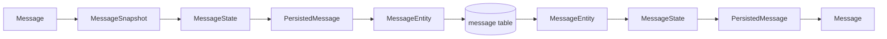

---
tags:
  - pabal
  - architecture
  - persistence
  - contract
  - mapping
---

# Pabal Persistence 경계와 데이터 변환

> 상위 문서: [Pabal 아키텍처 개요](overview.md)
> 관련 문서: [Pabal 패키지 구조와 레이어](package-structure-and-layers.md), [Pabal 런타임 흐름](runtime-flow.md), [Pabal 도메인 모델 상세](../domain/messenger-domain-model.md), [Pabal 멀티모듈 전환 전략](multi-module-transition.md), [Pabal 데이터베이스 스키마와 제약](database-schema-and-constraints.md)

## 왜 이 문서가 중요한가

Pabal Messenger는 domain model과 JPA entity를 직접 연결하지 않는다. 현재 구현은 다음 세 표현을 분리한다.

```text
Domain Model
↔ Persistence State / Persisted Wrapper
↔ JPA Entity
```

## 핵심 경계 규칙

- Layer: Domain - `Message`, `ChatRoom`, `ChatRoomMember`, `DirectChatMapping`은 JPA Entity를 모른다.
- Layer: Domain - domain은 `MessageState`, `PersistedMessage` 같은 contract persistence 모델을 import하지 않는다.
- Layer: Contract - `State`, `Persisted*`, `PersistenceMapper`가 domain ↔ persistence shape 변환을 담당한다.
- Layer: Application - repository port는 `pabal-messenger-application`의 `port.out.persistence`에 있다.
- Layer: Infrastructure - JPA Entity와 Spring Data repository는 `pabal-messenger-infrastructure` 안에만 둔다.

## Message 기준 변환 흐름



코드 흐름:

```text
Message.snapshot
→ MessageState
→ PersistedMessage
→ MessageEntity.fromNewState
→ MessageEntity.toState
→ MessagePersistenceMapper.toPersisted
→ Message.reconstitute
```

## Aggregate별 persistence 모델

| Domain Model | State | Persisted Wrapper | JPA Entity |
| --- | --- | --- | --- |
| `Message` | `MessageState` | `PersistedMessage` | `MessageEntity` |
| `ChatRoom` | `ChatRoomState` | `PersistedChatRoom` | `ChatRoomEntity` |
| `ChatRoomMember` | `ChatRoomMemberState` | `PersistedChatRoomMember` | `ChatRoomMemberEntity` |
| `DirectChatMapping` | `DirectChatMappingState` | `PersistedDirectChatMapping` | `DirectChatMappingEntity` |

각 aggregate는 domain snapshot을 통해 persistence shape로 넘어간다. `ChatRoomSnapshot`, `ChatRoomMemberSnapshot`, `DirectChatMappingSnapshot`, `MessageSnapshot`이 domain에 있고, contract `State`는 해당 snapshot을 감싼다. 예를 들어 `ChatRoomSnapshot`과 `ChatRoomState`는 `deletedAt`을 포함하며, `DELETED` 상태와 `deletedAt` 정합성을 snapshot 생성 시 검증한다.

## Repository port와 adapter

Layer: Application

- `MessageRepository`, `MessageReadRepository`, `MessageWriteRepository`
- `ChatRoomRepository`, `ChatRoomReadRepository`, `ChatRoomWriteRepository`
- `ChatRoomMemberRepository`, `ChatRoomMemberReadRepository`, `ChatRoomMemberWriteRepository`
- `DirectChatMappingRepository`, `DirectChatMappingReadRepository`, `DirectChatMappingWriteRepository`
- `ChatRoomSequenceRepository`

Layer: Infrastructure

- `MessageRepositoryImpl`은 read/write port를 조합하는 facade adapter다.
- `MessageWriteRepositoryImpl`은 `MessageEntity` 저장과 optimistic locking/version 검증을 담당한다.
- `MessageReadRepositoryImpl`은 조회와 unread count native query를 담당한다.
- `ChatRoomSequenceRepositoryImpl`은 room 단위 message sequence 할당과 last message snapshot 갱신을 담당한다.

## DB schema 경계

Layer: App / Infrastructure

Flyway migration은 `pabal-app/src/main/resources/db/migration`에 있다.

- `V1__postgres_extensions_and_uuidv7.sql`: `pgcrypto`, `uuidv7()` 함수
- `V2__messenger_tables.sql`: `chat_room`, `chat_room_member`, `direct_chat_mapping`, `message`

중요 제약:

- `uq_message_client_id`: room/sender/clientMessageId 기반 idempotency
- `uq_message_room_sequence`: room 내부 sequence uniqueness
- `uq_direct_chat_mapping`: tenant/user pair direct room uniqueness
- `uq_chat_room_channel_name_alive`: tenant/workspace/channel name uniqueness
- `chk_message_content_length`: message content 1~5000자 정책

전체 schema와 제약 설명은 [Pabal 데이터베이스 스키마와 제약](database-schema-and-constraints.md)에서 관리한다.

## 메시지 길이 정합성

Status: Implemented

현재 기준으로 API, Domain, DB의 메시지 길이 정책은 5000자로 정렬되어 있다.

- `SendMessageRequest.content`: `@Size(max = 5000)`
- `SendReplyRequest.content`: `@Size(max = 5000)`
- `EditMessageRequest.newContent`: `@Size(max = 5000)`
- `MessageContent.MAX_LENGTH = 5000`
- Flyway `message.content`: `TEXT NOT NULL` + `chk_message_content_length`

향후 이 정책을 바꾸면 API validation, domain VO, Flyway check constraint, 테스트를 함께 갱신해야 한다.

## 이 구조의 장점

- 도메인 순수성을 유지한다.
- DB schema, JPA Entity, 도메인 상태 전이의 책임이 섞이지 않는다.
- application handler 테스트와 infrastructure persistence 테스트를 분리하기 쉽다.
- 이후 read model, outbox, audit log, 외부 메시징으로 확장할 때 변경 지점을 찾기 쉽다.
