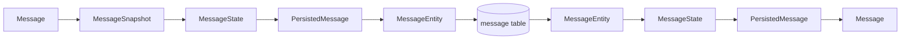

---
tags:
  - pabal
  - architecture
  - persistence
  - contract
  - mapping
---

# Pabal Persistence 경계와 데이터 변환

> 상위 문서: [Pabal 아키텍처 개요](overview.md)
> 관련 문서: [Pabal 패키지 구조와 레이어](package-structure-and-layers.md), [Pabal 런타임 흐름](runtime-flow.md), [Pabal 도메인 모델 상세](../domain/messenger-domain-model.md), [Pabal 멀티모듈 전환 전략](multi-module-transition.md), [Pabal 데이터베이스 스키마와 제약](database-schema-and-constraints.md)

## 왜 이 문서가 중요한가

Pabal의 bounded context는 domain model과 JPA entity를 직접 연결하지 않는다. 현재 구현은 다음 세 표현을 분리한다.

```text
Domain Model
↔ Persistence State / Persisted Wrapper
↔ JPA Entity
```

## 핵심 경계 규칙

- Layer: Domain - `Tenant`, `Workspace`, `WorkspaceMember`, `User`, `Message`, `ChatRoom`, `ChatRoomMember`, `DirectChatMapping`은 JPA Entity를 모른다.
- Layer: Domain - domain은 `MessageState`, `PersistedMessage` 같은 contract persistence 모델을 import하지 않는다.
- Layer: Contract - `State`, `Persisted*`, `PersistenceMapper`가 domain ↔ persistence shape 변환을 담당한다.
- Layer: Application - repository port는 각 bounded context의 application `port.out.persistence`에 있다.
- Layer: Infrastructure - JPA Entity와 Spring Data repository는 각 bounded context의 infrastructure 안에만 둔다.

## Message 기준 변환 흐름


```mermaid
flowchart LR
    message["Message"] --> snapshot["MessageSnapshot"]
    snapshot --> state["MessageState"]
    state --> persisted["PersistedMessage"]
    persisted --> entity["MessageEntity"]
    entity --> db[(message table)]

    db --> entity2["MessageEntity"]
    entity2 --> state2["MessageState"]
    state2 --> persisted2["PersistedMessage"]
    persisted2 --> message2["Message"]
```

코드 흐름:

```text
Message.snapshot
→ MessageState
→ PersistedMessage
→ MessageEntity.fromNewState
→ MessageEntity.toState
→ MessagePersistenceMapper.toPersisted
→ Message.reconstitute
```

## Aggregate별 persistence 모델

| Domain Model | State | Persisted Wrapper | JPA Entity |
| --- | --- | --- | --- |
| `Tenant` | `TenantState` | `PersistedTenant` | `TenantEntity` |
| `TenantRegistration` | `TenantRegistrationState` | `PersistedTenantRegistration` | `TenantRegistrationEntity` |
| `Workspace` | `WorkspaceState` | `PersistedWorkspace` | `WorkspaceEntity` |
| `WorkspaceMember` | `WorkspaceMemberState` | `PersistedWorkspaceMember` | `WorkspaceMemberEntity` |
| `User` | `UserState` | `PersistedUser` | `TenantUserEntity` |
| `Message` | `MessageState` | `PersistedMessage` | `MessageEntity` |
| `ChatRoom` | `ChatRoomState` | `PersistedChatRoom` | `ChatRoomEntity` |
| `ChatRoomMember` | `ChatRoomMemberState` | `PersistedChatRoomMember` | `ChatRoomMemberEntity` |
| `DirectChatMapping` | `DirectChatMappingState` | `PersistedDirectChatMapping` | `DirectChatMappingEntity` |

각 aggregate는 domain snapshot을 통해 persistence shape로 넘어간다. `TenantSnapshot`, `TenantRegistrationSnapshot`, `WorkspaceSnapshot`, `WorkspaceMemberSnapshot`, `UserSnapshot`, `ChatRoomSnapshot`, `ChatRoomMemberSnapshot`, `DirectChatMappingSnapshot`, `MessageSnapshot`이 domain에 있고, contract `State`는 해당 snapshot을 감싼다. 예를 들어 `ChatRoomSnapshot`과 `ChatRoomState`는 `deletedAt`을 포함하며, `DELETED` 상태와 `deletedAt` 정합성을 snapshot 생성 시 검증한다.

## TenantRegistration persistence read-path 경계

Layer: Contract / Application / Domain
Status: Implemented

`TenantRegistrationState`는 저장된 row shape를 운반하는 persistence state carrier다. `TenantRegistrationState`는 domain snapshot을 만들기 위한 필드와 `snapshot()` 변환만 제공하며, DNS/TXT verification 문자열을 formatting하는 `verificationDnsName()`/`verificationTxtValue()` helper나 prefix constant를 소유하지 않는다.

Verification DNS name과 TXT value의 production source of truth는 domain model인 `TenantRegistration`이다.

- `TenantRegistration.verificationDnsName()`은 `_pabal-verification.{canonicalDomain}`을 만든다.
- `TenantRegistration.verificationTxtValue()`는 `pabal-verification={token}`을 만든다.
- `GetTenantRegistrationQueryHandler`는 `TenantRegistrationRepository.findStateById`로 `TenantRegistrationState`를 읽은 뒤 `TenantRegistrationPersistenceMapper.toDomain(state)`로 reconstitute한 `TenantRegistration`에서 두 값을 얻어 `TenantRegistrationDto`에 담는다.
- command/query DTO와 API response shape는 바뀌지 않는다. read path도 persistence state에 저장된 primitive를 그대로 formatting하지 않고 domain을 거쳐 같은 값을 노출한다.

`PersistedTenant`는 `Tenant` domain object와 `TenantState`가 같은 aggregate row를 가리키는지 생성 시점에 확인한다. `tenant`/`state`가 `null`이면 즉시 실패하고, `tenant.getId()`와 `state.id()` 또는 `tenant.getName().value()`와 `state.name()`이 다르면 `IllegalArgumentException`으로 거부한다. 이 검증은 domain object와 persistence 기준점이 어긋난 wrapper가 repository 경계로 흘러가는 것을 막기 위한 contract layer 방어선이다.

## Persisted Wrapper의 identity guard와 rebind 패턴

Layer: Contract
Status: Implemented

`PersistedChatRoom`/`PersistedChatRoomMember`(Messenger)와 `PersistedWorkspace`/`PersistedWorkspaceMember`(Workspace)는 같은 모양의 compact constructor 방어선과 `withXxx(next)` rebind 메서드를 가진다.

- compact constructor는 `null` 체크 이후 domain object와 `State`의 identity 필드(예: `id`, `tenantId`, 그리고 member류는 소속 aggregate id/`userId`)가 일치하는지 `Objects.equals`로 비교하고, 어긋나면 `IllegalArgumentException`을 던진다.
- 검증 대상은 identity 필드로 한정된다. `role`, `status`, `joinedAt`/`leftAt`, `updatedAt`, `version` 같은 가변 필드는 비교하지 않는다. 그래서 `leave()`/`changeRole()`처럼 domain object가 전이된 이후에도, 조회 당시의 `state`와 함께 wrapper를 다시 만드는 동작(rebind)이 막히지 않는다.
- `withXxx(next)`는 새 domain object(`next`)를 원래 `state`에 다시 묶어 새 `Persisted*` 인스턴스를 반환한다. `state`는 그대로 보존된다 — optimistic lock 검증(`version`)과 row 식별(`id`)의 기준점이기 때문이다. `next`의 identity 필드가 `state`와 어긋나면 같은 방식으로 `IllegalArgumentException`을 던져, 다른 aggregate가 잘못 결합되는 배선 오류를 막는다.

| Persisted Wrapper | Identity 검증 필드 | Rebind 메서드 |
| --- | --- | --- |
| `PersistedTenant` | `id`, `name` | - |
| `PersistedWorkspace` | `id`, `tenantId` | `withWorkspace(Workspace next)` |
| `PersistedWorkspaceMember` | `id`, `tenantId`, `workspaceId`, `userId` | `withMember(WorkspaceMember next)` |
| `PersistedChatRoom` | `tenantId`(compact ctor), `id`+`tenantId`(rebind) | `withChatRoom(ChatRoom next)` |
| `PersistedChatRoomMember` | `tenantId`(compact ctor), `id`+`tenantId`+`chatRoomId`+`userId`(rebind) | `withMember(ChatRoomMember next)` |

`WorkspaceMemberState`는 `ChatRoomMemberState`/`WorkspaceState`와 같은 flatten 규칙을 따른다: snapshot을 감싸는 단일 component 대신 `id`, `tenantId`, `workspaceId`, `userId`, `role`, `status`, `joinedAt`, `leftAt`, `createdAt`, `updatedAt`, `version` 11개의 flat record component를 선언하고, `(WorkspaceMemberSnapshot, Long)` 편의 생성자와 flat component로부터 `WorkspaceMemberSnapshot`을 재구성하는 `snapshot()`을 제공한다. 접근자는 손으로 작성한 delegating 메서드가 아니라 record component accessor 그 자체다.

운영 주의: `TenantRegistrationState.snapshot()`은 `TenantName`, `TenantDomainName`, `TenantVerificationToken` 같은 domain VO를 다시 만든다. 따라서 향후 VO validation rule을 강화하면 기존 persistence row가 read path에서 reconstitution 실패를 일으킬 수 있다. 이런 변경은 배포 전에 migration/backfill을 함께 수행하거나, legacy row를 어떻게 읽을지에 대한 explicit read-path factory 결정을 먼저 문서화하고 구현해야 한다. 이 결정 없이 VO validation만 강화하면 query handler와 repository hydration이 운영 데이터에 의해 실패할 수 있다.

## Workspace update persistence와 optimistic locking

Layer: Application / Contract / Infrastructure
Status: Implemented

Workspace persistence update는 append/read와 같은 세 표현 경계를 유지한다.

```text
Workspace / WorkspaceMember
→ PersistedWorkspace / PersistedWorkspaceMember
→ WorkspaceState / WorkspaceMemberState
→ WorkspaceEntity / WorkspaceMemberEntity
```

Application port는 기존 위치에서 update를 노출한다.

- `WorkspaceRepository.update(PersistedWorkspace workspace)`
- `WorkspaceMemberRepository.update(PersistedWorkspaceMember member)`

입력 wrapper의 domain object는 저장하려는 post-transition 상태이고, `state()`는 이전 read/append가 돌려준 original persistence baseline이다. 따라서 application은 immutable domain transition 결과를 `withWorkspace(next)` 또는 `withMember(next)`로 원래 baseline에 다시 묶어 repository에 전달한다.

Infrastructure adapter는 baseline identity로 기존 row를 먼저 찾는다.

- `WorkspaceRepositoryImpl.update`는 `WorkspaceJpaRepository.findByTenantIdAndId(state.tenantId(), state.id())`로 조회한다.
- `WorkspaceMemberRepositoryImpl.update`는 `WorkspaceMemberJpaRepository.findByTenantIdAndId(state.tenantId(), state.id())`로 조회한다.
- baseline row가 없거나 tenant가 다르면 `EntityNotFoundException` 계열로 실패하고, detached/new entity 저장으로 insert하지 않는다.

Optimistic locking 기준점은 wrapper가 들고 온 original `state.version()`이다. Adapter는 entity의 현재 `@Version` 값과 baseline version을 비교하고, 다르면 `ObjectOptimisticLockingFailureException`을 던진 뒤 entity에 post-transition state를 적용하지 않는다.

Entity apply mapping은 persistence level에서 mutable한 필드만 반영한다.

| Entity | Apply 대상 | Preserve 대상 |
| --- | --- | --- |
| `WorkspaceEntity.apply(WorkspaceState)` | `name`, `status`, `updatedAt` | `id`, `tenantId`, `createdBy`, `createdAt` |
| `WorkspaceMemberEntity.apply(WorkspaceMemberState)` | `role`, `status`, `leftAt`, `updatedAt` | `id`, `tenantId`, `workspaceId`, `userId`, `joinedAt`, `createdAt` |

저장 후 반환값은 `saveAndFlush`가 반영한 현재 JPA `version`을 포함한 fresh `PersistedWorkspace` 또는 `PersistedWorkspaceMember`다. `WorkspaceMember` leave update가 `status = LEFT`와 non-null `leftAt`을 저장하면 active lookup(`existsActiveMember`, `findActiveRole`, `findActiveUserIds`)은 `status = ACTIVE` 조건 때문에 해당 user를 더 이상 active member로 보지 않는다.

## Repository port와 adapter

Layer: Application

- `UserRepository`
- `TenantRepository`
- `WorkspaceRepository`
- `WorkspaceMemberRepository`
- `MessageRepository`, `MessageReadRepository`, `MessageWriteRepository`
- `ChatRoomRepository`, `ChatRoomReadRepository`, `ChatRoomWriteRepository`
- `ChatRoomMemberRepository`, `ChatRoomMemberReadRepository`, `ChatRoomMemberWriteRepository`
- `DirectChatMappingRepository`, `DirectChatMappingReadRepository`, `DirectChatMappingWriteRepository`
- `ChatRoomSequenceRepository`

Layer: Infrastructure

- `UserRepositoryImpl`은 `TenantUserEntity`와 `TenantUserJpaRepository`를 통해 user persistence port를 구현한다.
- `TenantRepositoryImpl`은 `TenantEntity`와 `TenantJpaRepository`를 통해 tenant persistence port를 구현한다.
- `WorkspaceRepositoryImpl`은 `WorkspaceEntity`와 `WorkspaceJpaRepository`를 통해 workspace persistence port를 구현한다.
- `WorkspaceMemberRepositoryImpl`은 `WorkspaceMemberEntity`와 `WorkspaceMemberJpaRepository`를 통해 workspace membership persistence port를 구현한다.
- `MessageRepositoryImpl`은 read/write port를 조합하는 facade adapter다.
- `MessageWriteRepositoryImpl`은 `MessageEntity` 저장과 optimistic locking/version 검증을 담당한다.
- `MessageReadRepositoryImpl`은 조회와 unread count native query를 담당한다.
- `ChatRoomSequenceRepositoryImpl`은 room 단위 message sequence 할당과 last message snapshot 갱신을 담당한다.

## DB schema 경계

Layer: App / Infrastructure

Flyway migration은 `pabal-app/src/main/resources/db/migration`에 있다.

- `V1__postgres_extensions_and_uuidv7.sql`: `pgcrypto`, `uuidv7()` 함수
- `V2__messenger_tables.sql`: `chat_room`, `chat_room_member`, `direct_chat_mapping`, `message`
- `V3__tombstone_deleted_message_content.sql`: 기존 deleted message tombstone 보정
- `V4__tenant_user_tables.sql`: `tenant_user`
- `V5__tenant_tables.sql`: `pabal_tenant`
- `V6__workspace_tables.sql`: `workspace`, `workspace_member`

중요 제약:

- `chk_pabal_tenant_status`: tenant 상태 `ACTIVE`, `SUSPENDED`, `DELETED`
- `uq_workspace_tenant_id_id`: tenant 포함 workspace 식별 target
- `uq_workspace_member_tenant_workspace_user`: tenant/workspace/user 중복 membership 방지
- `fk_workspace_member_workspace`: tenant + workspace FK
- `uq_tenant_user_tenant_id_id`: tenant/user identity uniqueness
- `uq_message_client_id`: room/sender/clientMessageId 기반 idempotency
- `uq_message_room_sequence`: room 내부 sequence uniqueness
- `uq_direct_chat_mapping`: tenant/user pair direct room uniqueness
- `uq_chat_room_channel_name_alive`: tenant/workspace/channel name uniqueness
- `chk_message_content_length`: message content 1~5000자 정책

전체 schema와 제약 설명은 [Pabal 데이터베이스 스키마와 제약](database-schema-and-constraints.md)에서 관리한다.

## 메시지 길이 정합성

Status: Implemented

현재 기준으로 API, Domain, DB의 메시지 길이 정책은 5000자로 정렬되어 있다.

- `SendMessageRequest.content`: `@Size(max = 5000)`
- `SendReplyRequest.content`: `@Size(max = 5000)`
- `EditMessageRequest.newContent`: `@Size(max = 5000)`
- `MessageContent.MAX_LENGTH = 5000`
- Flyway `message.content`: `TEXT NOT NULL` + `chk_message_content_length`

향후 이 정책을 바꾸면 API validation, domain VO, Flyway check constraint, 테스트를 함께 갱신해야 한다.

## 이 구조의 장점

- 도메인 순수성을 유지한다.
- DB schema, JPA Entity, 도메인 상태 전이의 책임이 섞이지 않는다.
- application handler 테스트와 infrastructure persistence 테스트를 분리하기 쉽다.
- 이후 read model, outbox, audit log, 외부 메시징으로 확장할 때 변경 지점을 찾기 쉽다.
