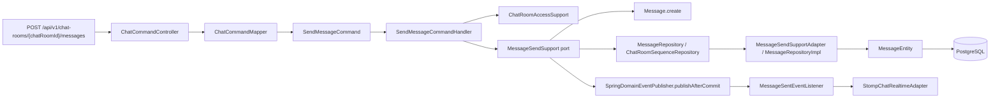
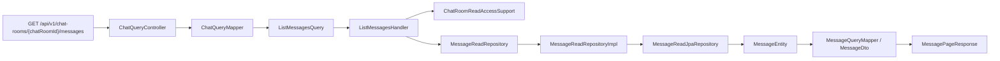
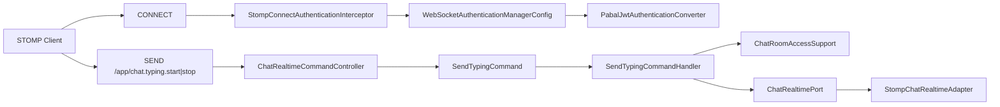

---
tags:
  - pabal
  - architecture
  - runtime
  - cqrs
  - realtime
---

# Pabal 런타임 흐름

> 상위 문서: [Pabal 아키텍처 개요](overview.md)
> 관련 문서: [Pabal 패키지 구조와 레이어](package-structure-and-layers.md), [Pabal 크로스커팅 관심사](cross-cutting-concerns.md), [Pabal Persistence 경계와 데이터 변환](persistence-boundary-and-mapping.md), [Pabal Realtime 이벤트 스키마](../realtime/event-schema.md)

## 1. HTTP Command 흐름

Layer: API → Application → Domain → Application Port → Infrastructure Adapter

대표 흐름: `sendMessage`



코드 흐름:

```text
ChatCommandController
→ ChatCommandMapper
→ SendMessageCommand
→ SendMessageCommandHandler
→ ChatRoomAccessSupport.loadSendableActiveMember
→ MessageSendSupport.findDuplicate
→ Message.create
→ MessageSendSupportAdapter.send
→ ChatRoomSequenceRepository.allocateNextMessageSequence
→ MessageRepository.append
→ MessageWriteRepositoryImpl
→ MessageEntity
→ SpringDomainEventPublisher.publishAfterCommit
→ MessageSentEventListener
→ StompChatRealtimeAdapter
```

포인트:

- `tenantId`, `userId`는 `PabalPrincipal`에서 추출한다.
- 중복 전송은 `clientMessageId` 기반으로 흡수한다.
- 메시지 sequence는 `ChatRoomSequenceRepositoryImpl`이 `chat_room.last_message_sequence`를 증가시켜 할당한다.
- application은 `MessageSendSupport` interface만 의존하고, 실제 `REQUIRES_NEW` transaction은 infrastructure의 `MessageSendSupportAdapter`가 가진다.
- room event는 transaction commit 이후 listener를 통해 전송된다.

## 2. HTTP Query 흐름

Layer: API → Application → Application Port → Infrastructure Adapter → API

대표 흐름: `listMessages`



포인트:

- read 흐름도 room/member 접근 검증을 먼저 수행한다.
- cursor는 message `sequence` 기준이며, DB에서는 내림차순으로 읽고 response에는 오래된 순서로 뒤집는다.
- unread count는 sender 자신과 `DELETED` 메시지를 제외한다.

## 3. Realtime inbound 흐름

Layer: Infrastructure Security → API → Application → Application Port → Infrastructure Adapter



코드 흐름:

```text
StompConnectAuthenticationInterceptor
→ WebSocketAuthenticationManagerConfig
→ PabalJwtAuthenticationConverter
→ ChatRealtimeCommandController
→ SendTypingCommandHandler
→ ChatRealtimePort.publishTyping
→ StompChatRealtimeAdapter
```

포인트:

- CONNECT 인증은 STOMP native header `Authorization: Bearer ...` 또는 `access_token`을 사용한다.
- `TypingRequest.tenantId`는 principal tenant와 반드시 일치해야 한다.
- typing은 DB 상태 변경 없이 `TypingEventPayload`를 topic으로 보낸다.

## 4. Realtime outbound 흐름

Layer: Domain Event → Application Listener → Application Port → Infrastructure Adapter

```mermaid
flowchart LR
    stateChange["State Change"] --> event["DomainEvent"]
    event --> afterCommit["publishAfterCommit"]
    afterCommit --> listener["MessageSentEventListener 등"]
    listener --> payload["Realtime Payload"]
    payload --> envelope["RoomEventEnvelope"]
    envelope --> port["ChatRealtimePort"]
    port --> adapter["StompChatRealtimeAdapter"]
    adapter --> topic["/topic/tenants/{tenantId}/chat-rooms/{chatRoomId}/events"]
```



주요 listener:

- `MessageSentEventListener`
- `MessageEditedEventListener`
- `MessageDeletedEventListener`
- `MessageReadEventListener`
- `MemberJoinedEventListener`
- `MemberLeftEventListener`

## 5. 읽을 때 추천하는 디버깅 순서

1. controller entry 확인
2. mapper에서 principal이 command/query로 바뀌는 방식 확인
3. handler에서 support/service와 port 호출 순서 확인
4. domain entity가 어떤 invariant를 강제하는지 확인
5. repository adapter가 `State`/JPA Entity를 변환하는 방식 확인
6. event listener가 어떤 realtime payload를 보내는지 확인

## 연결 문서

- 레이어 책임은 [Pabal 패키지 구조와 레이어](package-structure-and-layers.md)
- 인증/인가/멀티테넌시 관점은 [Pabal 크로스커팅 관심사](cross-cutting-concerns.md)
- persistence 모델 변환은 [Pabal Persistence 경계와 데이터 변환](persistence-boundary-and-mapping.md)
- realtime payload는 [Pabal Realtime 이벤트 스키마](../realtime/event-schema.md)
