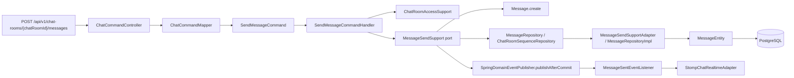
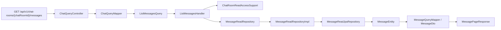
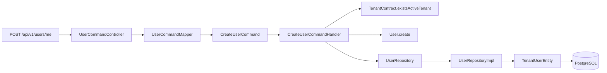
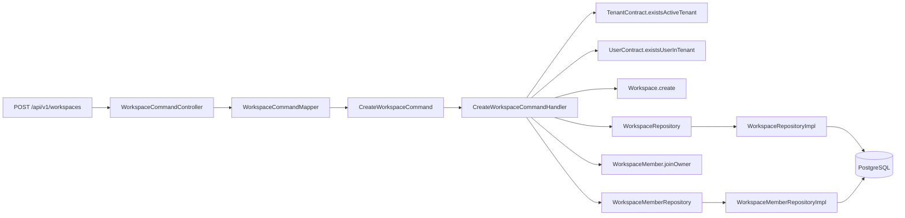
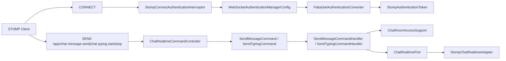

---
tags:
  - pabal
  - architecture
  - runtime
  - cqrs
  - realtime
---

# Pabal 런타임 흐름

> 상위 문서: [Pabal 아키텍처 개요](overview.md)
> 관련 문서: [Pabal 패키지 구조와 레이어](package-structure-and-layers.md), [Pabal 크로스커팅 관심사](cross-cutting-concerns.md), [Pabal Persistence 경계와 데이터 변환](persistence-boundary-and-mapping.md), [Pabal Realtime 이벤트 스키마](../realtime/event-schema.md)

## 1. HTTP Command 흐름

Layer: API → Application → Domain → Application Port → Infrastructure Adapter

대표 흐름: `sendMessage`


```mermaid
flowchart LR
    req["POST /api/v1/chat-rooms/{chatRoomId}/messages"] --> controller["ChatCommandController"]
    controller --> mapper["ChatCommandMapper"]
    mapper --> command["SendMessageCommand"]
    command --> handler["SendMessageCommandHandler"]
    handler --> access["ChatRoomAccessSupport"]
    handler --> support["MessageSendSupport port"]
    support --> domain["Message.create"]
    support --> port["MessageRepository / ChatRoomSequenceRepository"]
    port --> adapter["MessageSendSupportAdapter / MessageRepositoryImpl"]
    adapter --> entity["MessageEntity"]
    entity --> db[(PostgreSQL)]
    support --> eventPublisher["SpringDomainEventPublisher.publishAfterCommit"]
    eventPublisher --> listener["MessageSentEventListener"]
    listener --> realtime["StompChatRealtimeAdapter"]
```

코드 흐름:

```text
ChatCommandController
→ ChatCommandMapper
→ SendMessageCommand
→ SendMessageCommandHandler
→ ChatRoomAccessSupport.loadSendableActiveMember
→ RoomParticipantDirectoryPort.existsActiveTenantMember
→ MessageSendSupport.findDuplicate
→ Message.create
→ MessageSendSupportAdapter.send
→ ChatRoomSequenceRepository.allocateNextMessageSequence
→ MessageRepository.append
→ MessageWriteRepositoryImpl
→ MessageEntity
→ SpringDomainEventPublisher.publishAfterCommit
→ MessageSentEventListener
→ StompChatRealtimeAdapter
```

포인트:

- `tenantId`, `userId`는 `PabalPrincipal`에서 추출한다.
- `ChatRoomAccessSupport.loadSendableActiveMember`는 room active member 여부와 별도로 `RoomParticipantDirectoryPort.existsActiveTenantMember`를 통해 sender가 user module의 active tenant user인지 확인한다.
- 중복 전송은 `clientMessageId` 기반으로 흡수한다.
- 메시지 sequence는 `ChatRoomSequenceRepositoryImpl`이 `chat_room.last_message_sequence`를 증가시켜 할당한다.
- application은 `MessageSendSupport` interface만 의존하고, 실제 `REQUIRES_NEW` transaction은 infrastructure의 `MessageSendSupportAdapter`가 가진다.
- room event는 transaction commit 이후 listener를 통해 전송된다.

## 2. HTTP Query 흐름

Layer: API → Application → Application Port → Infrastructure Adapter → API

대표 흐름: `listMessages`


```mermaid
flowchart LR
    req["GET /api/v1/chat-rooms/{chatRoomId}/messages"] --> controller["ChatQueryController"]
    controller --> mapper["ChatQueryMapper"]
    mapper --> query["ListMessagesQuery"]
    query --> handler["ListMessagesHandler"]
    handler --> access["ChatRoomReadAccessSupport"]
    handler --> port["MessageReadRepository"]
    port --> adapter["MessageReadRepositoryImpl"]
    adapter --> jpa["MessageReadJpaRepository"]
    jpa --> entity["MessageEntity"]
    entity --> dto["MessageQueryMapper / MessageDto"]
    dto --> response["MessagePageResponse"]
```

포인트:

- read 흐름도 room/member 접근 검증을 먼저 수행한다.
- cursor는 message `sequence` 기준이며, DB에서는 내림차순으로 읽고 response에는 오래된 순서로 뒤집는다.
- `DELETED` 메시지는 sequence 보존을 위해 조회될 수 있으나 DTO content는 tombstone 값 `[deleted]`로 마스킹한다.
- unread count는 sender 자신과 `DELETED` 메시지를 제외한다.

## 3. User HTTP 흐름

Layer: API → Application → Domain → Application Port → Infrastructure Adapter

대표 흐름: `createMe`


```mermaid
flowchart LR
    req["POST /api/v1/users/me"] --> controller["UserCommandController"]
    controller --> mapper["UserCommandMapper"]
    mapper --> command["CreateUserCommand"]
    command --> handler["CreateUserCommandHandler"]
    handler --> tenantContract["TenantContract.existsActiveTenant"]
    handler --> domain["User.create"]
    handler --> port["UserRepository"]
    port --> adapter["UserRepositoryImpl"]
    adapter --> entity["TenantUserEntity"]
    entity --> db[(PostgreSQL)]
```

포인트:

- `tenantId`, `userId`는 `PabalPrincipal`에서 추출하고 request body에는 `name`만 받는다.
- `CreateUserCommandHandler`는 `TenantContract.existsActiveTenant`로 active tenant를 먼저 확인한다. 중복 userId가 이미 있으면 duplicate user 예외가 tenant 검증보다 먼저 발생한다.
- `tenant_user`는 user module의 source of truth다.
- Messenger가 participant 존재를 확인할 때는 `UserContractService`를 통해 active tenant user 여부를 조회한다.

## 4. Workspace HTTP 흐름

Layer: API → Application → Domain → Application Port → Infrastructure Adapter

대표 흐름: `createWorkspace`


```mermaid
flowchart LR
    req["POST /api/v1/workspaces"] --> controller["WorkspaceCommandController"]
    controller --> mapper["WorkspaceCommandMapper"]
    mapper --> command["CreateWorkspaceCommand"]
    command --> handler["CreateWorkspaceCommandHandler"]
    handler --> tenantContract["TenantContract.existsActiveTenant"]
    handler --> userContract["UserContract.existsUserInTenant"]
    handler --> workspace["Workspace.create"]
    handler --> workspaceRepo["WorkspaceRepository"]
    handler --> member["WorkspaceMember.joinOwner"]
    handler --> memberRepo["WorkspaceMemberRepository"]
    workspaceRepo --> workspaceAdapter["WorkspaceRepositoryImpl"]
    memberRepo --> memberAdapter["WorkspaceMemberRepositoryImpl"]
    workspaceAdapter --> db[(PostgreSQL)]
    memberAdapter --> db
```

포인트:

- `tenantId`, `ownerId`는 `PabalPrincipal`에서 추출하고 request body에는 `name`만 받는다.
- workspace 생성은 active tenant와 active tenant user owner를 모두 요구한다.
- 생성된 workspace id로 owner `WorkspaceMember`를 만들고 `OWNER` role, `ACTIVE` status로 저장한다.
- Messenger channel participant validation은 `WorkspaceContractService`를 통해 active workspace member를 batch 조회한다.

## 5. Realtime inbound 흐름

Layer: Infrastructure Security → API → Application → Application Port → Infrastructure Adapter


```mermaid
flowchart LR
    client["STOMP Client"] --> connect["CONNECT"]
    connect --> interceptor["StompConnectAuthenticationInterceptor"]
    interceptor --> authManager["WebSocketAuthenticationManagerConfig"]
    authManager --> converter["PabalJwtAuthenticationConverter"]
    converter --> stompToken["StompAuthenticationToken"]
    client --> send["SEND /app/chat.message.send|chat.typing.start|stop"]
    send --> controller["ChatRealtimeCommandController"]
    controller --> command["SendMessageCommand / SendTypingCommand"]
    command --> handler["SendMessageCommandHandler / SendTypingCommandHandler"]
    handler --> access["ChatRoomAccessSupport"]
    handler --> port["ChatRealtimePort"]
    port --> adapter["StompChatRealtimeAdapter"]
```

코드 흐름:

```text
StompConnectAuthenticationInterceptor
→ WebSocketAuthenticationManagerConfig
→ PabalJwtAuthenticationConverter
→ StompAuthenticationToken
→ ChatRealtimeCommandController
→ SendMessageCommandHandler / SendTypingCommandHandler
→ Message persistence + after-commit room event / ChatRealtimePort.publishTyping
→ StompChatRealtimeAdapter
```

포인트:

- CONNECT 인증은 STOMP native header `Authorization: Bearer ...` 또는 `access_token`을 사용한다.
- STOMP accessor user는 `PabalJwtAuthenticationToken`을 감싼 `StompAuthenticationToken`이며, principal은 `PabalPrincipal`로 유지된다.
- `SendMessageWsRequest.tenantId`와 `TypingRequest.tenantId`는 principal tenant와 반드시 일치해야 한다.
- message send는 HTTP `SendMessage`와 같은 application handler를 사용하고, commit 이후 room event로 broadcast된다.
- typing은 DB 상태 변경 없이 `TypingEventPayload`를 topic으로 보낸다.

## 6. Realtime outbound 흐름

Layer: Domain Event → Application Listener → Application Port → Infrastructure Adapter


```mermaid
flowchart LR
    stateChange["State Change"] --> event["DomainEvent"]
    event --> afterCommit["publishAfterCommit"]
    afterCommit --> listener["MessageSentEventListener 등"]
    listener --> payload["Realtime Payload"]
    payload --> envelope["RoomEventEnvelope"]
    envelope --> port["ChatRealtimePort"]
    port --> adapter["StompChatRealtimeAdapter"]
    adapter --> topic["/topic/tenants/{tenantId}/chat-rooms/{chatRoomId}/events"]
```

주요 listener:

- `MessageSentEventListener`
- `MessageEditedEventListener`
- `MessageDeletedEventListener`
- `MessageReadEventListener`
- `MemberJoinedEventListener`
- `MemberLeftEventListener`

## 7. 읽을 때 추천하는 디버깅 순서

1. controller entry 확인
2. mapper에서 principal이 command/query로 바뀌는 방식 확인
3. handler에서 support/service와 port 호출 순서 확인
4. domain entity가 어떤 invariant를 강제하는지 확인
5. repository adapter가 `State`/JPA Entity를 변환하는 방식 확인
6. event listener가 어떤 realtime payload를 보내는지 확인

## 연결 문서

- 레이어 책임은 [Pabal 패키지 구조와 레이어](package-structure-and-layers.md)
- 인증/인가/멀티테넌시 관점은 [Pabal 크로스커팅 관심사](cross-cutting-concerns.md)
- persistence 모델 변환은 [Pabal Persistence 경계와 데이터 변환](persistence-boundary-and-mapping.md)
- realtime payload는 [Pabal Realtime 이벤트 스키마](../realtime/event-schema.md)
