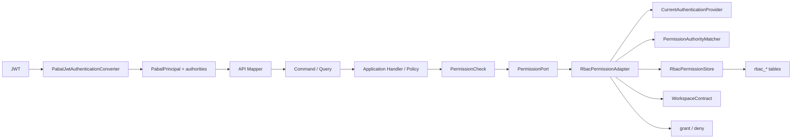

---
tags:
  - pabal
  - security
  - authorization
  - rbac
  - governance
---

# Pabal Authorization Governance와 RBAC Permission 모델

> 상위 문서: [Pabal 상세 설계 허브](../design/design-hub.md)  
> 관련 문서: [Pabal 보안과 JWT Claim 설계](jwt-claim-design.md), [Pabal 인가 경계와 멀티테넌시 체크포인트](authorization-and-multitenancy.md), [Pabal 크로스커팅 관심사](../architecture/cross-cutting-concerns.md), [ADR-0011](../adr/0011-manage-authorization-as-cross-cutting-policy.md)

## 개요

Layer: Security → Authorization → API → Application → Application Port → Infrastructure / App

Status: Partial: RBAC DB catalog/store, optional Redis cache, and refresh token lifecycle are implemented; role administration APIs are pending

Pabal의 인가는 enterprise application의 cross-cutting 관심사로 관리한다. 인증은 `pabal-security`에서 JWT를 `PabalPrincipal`과 authority set으로 정규화하고, 공통 authority/RBAC 처리는 `pabal-authorization`이 맡는다. Redis client dependency는 `pabal-infra-redis`에 모아 authorization cache와 향후 module별 cache layer가 같은 Redis infrastructure를 재사용할 수 있게 한다. 유스케이스 인가는 각 bounded context의 application layer에서 fine-grained permission으로 판정한다. Infrastructure adapter는 JWT authority, DB-backed RBAC permission, module-owned role source를 읽어 application `PermissionPort` 결과로 변환한다.

핵심 원칙:

- JWT claim은 인증/인가 입력이지 도메인 source of truth가 아니다.
- role은 coarse-grained grant bundle이고, use case는 fine-grained permission을 요구한다.
- permission requirement는 controller나 domain이 아니라 application service/policy에서 결정한다.
- module 간 권한 판단에 필요한 데이터는 repository/JPA 공유가 아니라 common contract로 조회한다.
- domain은 security, JWT, role, permission adapter를 모른다.

## 용어

| 용어 | 의미 | 현재 코드 |
| --- | --- | --- |
| Principal | 인증된 tenant/user identity | `PabalPrincipal(userId, tenantId, subject)` |
| Authority | JWT claim에서 정규화된 Spring authority string | `PabalJwtAuthenticationConverter` |
| Role | coarse-grained RBAC 입력 | `ROLE_TENANT_ADMIN`, `ROLE_WORKSPACE_ADMIN` 등 |
| Persisted RBAC role | tenant 안에서 user에게 할당되는 role bundle | `rbac_role`, `rbac_user_role` |
| Permission | use case가 요구하는 action-level contract | `MessengerPermission`, `FineGrainedPermission` |
| Scope | permission 적용 범위 | `tenant:{tenantId}:...`, `workspace:{workspaceId}:...` |
| Ownership role | 업무 데이터가 소유하는 role source | `workspace_member.role` |
| Authorization adapter | JWT/DB RBAC/ownership을 permission grant로 변환 | `RbacPermissionAdapter` |

## Runtime 흐름



코드 흐름 예:

```text
ChatCommandController
→ ChatCommandMapper / SendMessageCommandMapper
→ CreateChannelRoomCommandHandler / ChatRoomDeletionSupport
→ ChatRoomAuthorizationService
→ PermissionPort.hasPermission(PermissionCheck)
→ RbacPermissionAdapter
→ CurrentAuthenticationProvider + PermissionAuthorityMatcher + RbacPermissionStore + WorkspaceContract
```

## JWT authority 관리

Layer: Security

Status: Implemented

JWT 변환은 `pabal-security`의 책임이다. `PabalJwtAuthenticationConverter`는 claim을 다음 authority로 정규화한다. role normalization은 `pabal-authorization`의 `AuthorityNormalizer.role`을 사용하며, scoped role 값을 운영 IAM에서 직접 발급할 수 있도록 `:`와 `-`를 `_`로 정규화한다.

| Claim | 입력 예 | Authority 예 |
| --- | --- | --- |
| `scope`, `scp` | `messenger:channel:create` | `SCOPE_messenger:channel:create` |
| `permissions` | `["messenger:channel:create"]` | `messenger:channel:create` |
| `roles` | `["tenant_admin"]` | `ROLE_TENANT_ADMIN` |
| `roles` | `["tenant:{tenantId}:admin"]` | `ROLE_TENANT_{NORMALIZED_TENANT_ID}_ADMIN` |
| `roles` | `["workspace:{workspaceId}:owner"]` | `ROLE_WORKSPACE_{NORMALIZED_WORKSPACE_ID}_OWNER` |
| `realm_access.roles` | `["workspace-admin"]` | `ROLE_WORKSPACE_ADMIN` |
| `resource_access.*.roles` | `["pabal-admin"]` | `ROLE_PABAL_ADMIN` |

운영 규칙:

- JWT converter는 claim normalization만 수행한다.
- converter는 role-permission matrix를 알면 안 된다.
- Access token은 short-lived로 운영하고, persisted RBAC 변경은 DB/cache 조회 경로에서 반영한다.
- tenant/user identity는 `uid`, `tenant_id`, `sub` claim에서만 만든다.
- request body의 tenant/user 값은 권한 판단에 사용하지 않는다.
- permission claim은 가능한 한 scoped form을 사용한다.

권장 scoped authority 형식:

```text
tenant:{tenantId}:{permission}
user:{userId}:{permission}
workspace:{workspaceId}:{permission}
room:{chatRoomId}:{permission}
SCOPE_tenant:{tenantId}:{permission}
SCOPE_workspace:{workspaceId}:{permission}
```

Global role은 운영 편의를 위해 허용하지만, 장기적으로는 tenant/workspace scope가 붙은 role 또는 fine-grained permission을 우선한다.

## RBAC와 fine-grained permission 관리

Layer: Application / Infrastructure

Status: Implemented for DB permission catalog/store, optional Redis cache, and Messenger channel enforcement; management APIs pending

Application은 role을 직접 해석하지 않는다. Application은 `PermissionCheck`에 tenant, requester, resource scope, required permission을 담아 `PermissionPort`를 호출한다. `PermissionCheck.authorizationScopes()`는 `AuthorizationScope` 목록으로 tenant/user/workspace/room scope를 제공한다.

```text
Application policy
→ PermissionCheck(tenantId, requesterId, workspaceId, chatRoomId, permission)
→ PermissionPort
→ PermissionAuthorityMatcher + Infrastructure authorization adapter
```

관리 규칙:

- permission enum은 해당 bounded context application module이 소유한다.
- 공통 모듈은 `FineGrainedPermission` interface만 제공한다.
- central mega-permission enum은 만들지 않는다.
- role-permission mapping은 `rbac_role_permission` 또는 제한된 platform JWT role 정책으로 관리한다.
- ownership role은 해당 데이터를 소유한 module contract로 조회한다.
- permission 추가 시 code enum, Flyway catalog seed, 문서, 테스트, IAM claim 발급 정책을 함께 갱신한다.

## Persisted RBAC store

Layer: Authorization / App

Status: Implemented

RBAC source of truth는 Flyway `V8__authorization_rbac_tables.sql`의 `rbac_*` 테이블이다. `pabal-authorization`은 DB row를 domain model로 끌어올리지 않고 `RbacPermissionStore`를 통해 현재 principal의 permission value set만 조회한다.

```text
rbac_permission
rbac_role
rbac_role_permission
rbac_user_role
```

런타임 조회는 tenant/user 격리 조건과 active role/assignment 조건을 함께 사용한다.

```sql
SELECT DISTINCT p.value
FROM rbac_user_role ur
JOIN rbac_role r
  ON r.tenant_id = ur.tenant_id
 AND r.id = ur.role_id
JOIN rbac_role_permission rp
  ON rp.tenant_id = r.tenant_id
 AND rp.role_id = r.id
JOIN rbac_permission p
  ON p.id = rp.permission_id
WHERE ur.tenant_id = :tenantId
  AND ur.user_id = :userId
  AND ur.revoked_at IS NULL
  AND r.status = 'ACTIVE';
```

현재 구현:

- `RbacPermissionStore`: tenant/user의 resolved permission value set 조회와 cache evict 계약
- `JdbcRbacPermissionStore`: Redis read-through cache를 먼저 확인하고 miss/failure 시 `rbac_*` 테이블을 조회하는 DB-backed 구현
- `RbacPermissionAdapter`: JWT direct permission, JWT platform role, persisted RBAC permission, workspace membership role을 순서대로 평가
- `pabal-infra-redis`: Redis starter dependency를 공유 infra module로 제공

운영 규칙:

- `rbac_role.tenant_id`는 role 격리 기준이다.
- `rbac_user_role`은 user-role assignment source of truth다.
- `rbac_role_permission`은 role bundle이 어떤 fine-grained permission을 포함하는지 정의한다.
- role 비활성화는 `rbac_role.status = DISABLED`, assignment 취소는 `rbac_user_role.revoked_at`으로 표현한다.
- Redis cache key는 `rbac:permissions:{tenantId}:{userId}` 형태이고 기본 TTL은 5분이다.
- role/assignment 변경 use case는 `RbacPermissionStore.evictPermissionValues(tenantId, userId)`를 호출해야 한다.

## Access/refresh token strategy

Layer: Security / App

Status: Implemented for internal/local issuer path

Authorization 변경 즉시성과 JWT stateless 검증 사이의 균형은 다음 전략으로 관리한다.

| Token | 저장 위치 | 기본 TTL | 관리 규칙 |
| --- | --- | --- | --- |
| Access token | client only | 60~90분 random | JWT로 tenant/user identity를 전달하고, permission source of truth로 사용하지 않는다 |
| Refresh token | client raw token, DB hash, Redis replay cache | 7일 | opaque token으로 발급하고 refresh 시 `used_at` 기준 rotate한다. Grace period 안의 duplicate refresh와 동일 `X-Request-ID` 요청은 Redis replay cache로 같은 token pair를 반환한다 |
| RBAC permission cache | Redis optional | 5분 | `rbac:permissions:{tenantId}:{userId}` key를 사용하고 role/assignment 변경 시 evict한다 |

Code:

- `RefreshTokenService`
- `RefreshTokenStore`
- `JdbcRefreshTokenStore`
- `RedisRefreshTokenReplayCache`
- `RefreshTokenController`
- `V9__security_refresh_tokens.sql`

권한 변경 use case는 다음을 한 transaction boundary 안에서 수행해야 한다.

```text
role/assignment 변경
→ RbacPermissionStore.evictPermissionValues(tenantId, userId)
→ RefreshTokenService.revokeUserTokens(tenantId, userId)
```

이렇게 하면 기존 access token은 짧은 TTL 안에서 사라지고, 3초 grace period를 지난 refresh token 재사용은 차단되며, 다음 인증 흐름에서 DB RBAC 기준 권한을 다시 반영할 수 있다.

## 현재 module별 권한 책임

| Module | Layer | 권한/role 책임 | 현재 상태 |
| --- | --- | --- | --- |
| `pabal-security` | Security | JWT 검증, principal 생성, `CurrentAuthenticationProvider`, `RefreshTokenService`, `JdbcRefreshTokenStore`; refresh token security infrastructure JDBC is intentionally retained here | Implemented |
| `pabal-authorization` | Authorization | `AuthorityNormalizer`, `PermissionAuthorityMatcher`, `RbacPermissionStore`, `JdbcRbacPermissionStore` | Implemented |
| `pabal-infra-redis` | Shared Infrastructure | Redis dependency boundary for cache/pub-sub adapters | Implemented |
| `pabal-common` | Common | `FineGrainedPermission`, `AuthorizationScope`, `TenantContract`, `UserContract`, `WorkspaceContract`, `WorkspaceMemberRole` | Implemented |
| `pabal-tenant-*` | Domain/Application/Infrastructure | active tenant source of truth, tenant registration lifecycle, `TenantPermission` catalog | Partial: role administration API pending |
| `pabal-user-*` | Domain/Application/Infrastructure | active tenant user source of truth, `UserPermission` catalog | Partial: user administration use-case permission enforcement pending |
| `pabal-workspace-*` | Domain/Application/Infrastructure | `workspace_member.role` source of truth, active role contract, `WorkspacePermission` catalog | Partial: workspace management permission enforcement pending |
| `pabal-messenger-application` | Application | `MessengerPermission`, `PermissionCheck`, `PermissionPort`, `ChatRoomAuthorizationService` | Implemented |
| `pabal-messenger-infrastructure` | Infrastructure | `RbacPermissionAdapter`, current authority + DB RBAC + workspace role mapping | Implemented |
| `pabal-app` | App | module wiring, Flyway migration, RBAC table/catalog seed, runtime assembly | Implemented |
| `pabal-web` | Web Support | access denied/error response normalization | Implemented |

## 현재 role-permission mapping

Layer: Authorization / Infrastructure / App

Code:

- `AuthorityNormalizer`
- `PermissionAuthorityMatcher`
- `RbacPermissionStore`
- `JdbcRbacPermissionStore`
- `RbacPermissionAdapter`

`{tenantId}`와 `{workspaceId}`가 role authority에 들어갈 때는 `AuthorityNormalizer.token` 규칙을 따른다. 현재 규칙은 대문자 변환 후 `:`와 `-`를 `_`로 바꾸는 방식이다.

| Grant source | Permission grant |
| --- | --- |
| active `rbac_user_role` + active `rbac_role` + `rbac_role_permission` | `rbac_permission.value`에 정의된 fine-grained permission |
| `ROLE_PABAL_ADMIN` | 모든 Messenger permission |
| `ROLE_TENANT_OWNER`, `ROLE_TENANT_ADMIN` | principal tenant 범위의 모든 Messenger permission |
| `ROLE_TENANT_{NORMALIZED_TENANT_ID}_OWNER`, `ROLE_TENANT_{NORMALIZED_TENANT_ID}_ADMIN` | 해당 tenant 범위의 모든 Messenger permission |
| `ROLE_WORKSPACE_OWNER`, `ROLE_WORKSPACE_ADMIN` | workspace-scoped channel create/invite, any deletion |
| `ROLE_WORKSPACE_{NORMALIZED_WORKSPACE_ID}_OWNER`, `ROLE_WORKSPACE_{NORMALIZED_WORKSPACE_ID}_ADMIN` | 해당 workspace channel create/invite, any deletion |
| active `workspace_member.role = OWNER` | 해당 workspace channel create/invite, any deletion |
| active `workspace_member.role = ADMIN` | 해당 workspace channel create/invite, any deletion |
| `ROLE_CHANNEL_OWNER` | own deletion permission |
| raw `{permission}` | 해당 permission |
| `SCOPE_{permission}` | 해당 permission |
| `PERMISSION_{NORMALIZED_PERMISSION}` | 해당 permission |
| `tenant:{tenantId}:{permission}`와 `SCOPE_` variant | tenant scope 일치 시 해당 permission |
| `user:{userId}:{permission}`와 `SCOPE_` variant | requester user scope 일치 시 해당 permission |
| `workspace:{workspaceId}:{permission}`와 `SCOPE_` variant | workspace scope 일치 시 해당 permission |
| `room:{chatRoomId}:{permission}`와 `SCOPE_` variant | room scope 일치 시 해당 permission |

`ROLE_CHANNEL_OWNER`는 channel 생성자 판정을 대체하지 않는다. `ChatRoomAuthorizationService`가 `ChatRoom.createdBy`와 requester를 비교해 own/any permission 중 무엇이 필요한지 먼저 결정한다.

JWT tenant/workspace role mapping은 local/test와 platform fallback을 위한 coarse-grained 경로다. 운영에서 tenant owner/admin, workspace admin 같은 업무 role을 즉시 반영해야 하는 경우 `rbac_user_role`과 `rbac_role_permission`을 source of truth로 삼는다.

## Enterprise role templates

Layer: Security / App

Status: Proposed templates, implemented as RBAC-compatible mapping guidance

`rbac_role`은 tenant별 row이므로 아래 role은 template 이름이다. 실제 role row는 tenant bootstrap 또는 admin API에서 생성한다.

| Role template | Permission composition |
| --- | --- |
| `TENANT_OWNER` | 모든 `tenant:*`, `user:*`, `workspace:*`, `messenger:*` permission |
| `TENANT_ADMIN` | `tenant:read`, `tenant:update`, `tenant:member:read`, `user:*`, `workspace:*`, `messenger:*` |
| `USER_ADMIN` | `user:create`, `user:read:all`, `user:update:all`, `user:disable` |
| `WORKSPACE_OWNER` | `workspace:read`, `workspace:update`, `workspace:archive`, `workspace:member:*`, workspace-scoped `messenger:channel:*` admin permission |
| `WORKSPACE_ADMIN` | `workspace:read`, `workspace:update`, `workspace:member:read`, `workspace:member:invite`, workspace-scoped `messenger:channel:create`, `messenger:channel:invite`, any deletion permission |
| `WORKSPACE_MEMBER` | `workspace:read`, user self read/update, room participation permissions granted by room membership rules |
| `MESSENGER_CHANNEL_OWNER` | own channel deletion permissions for requester-created channel |

Role template을 DB에 적용할 때는 `rbac_role_permission`에 fine-grained permission row를 명시적으로 연결한다. wildcard는 문서 표현일 뿐이고 DB permission은 항상 concrete value로 저장한다.

## Messenger permission catalog

Layer: Messenger Application

Code: `MessengerPermission`

| Permission | Value | Required by | 관리자 grant |
| --- | --- | --- | --- |
| `CHANNEL_CREATE` | `messenger:channel:create` | workspace channel 생성 | tenant owner/admin, pabal admin, workspace owner/admin |
| `CHANNEL_INVITE` | `messenger:channel:invite` | workspace channel participant 초대 | tenant owner/admin, pabal admin, workspace owner/admin |
| `ROOM_INVITE` | `messenger:room:invite` | tenant group room participant 초대 | tenant owner/admin, pabal admin |
| `CHANNEL_DELETE_SCHEDULE_OWN` | `messenger:channel:delete:schedule:own` | 자신이 만든 channel 삭제 예약 | tenant owner/admin, pabal admin, channel owner |
| `CHANNEL_DELETE_SCHEDULE_ANY` | `messenger:channel:delete:schedule:any` | target channel 생성자와 무관한 삭제 예약 | tenant owner/admin, pabal admin, workspace owner/admin |
| `CHANNEL_DELETE_EXECUTE_OWN` | `messenger:channel:delete:execute:own` | 자신이 만든 channel 즉시 삭제 | tenant owner/admin, pabal admin, channel owner |
| `CHANNEL_DELETE_EXECUTE_ANY` | `messenger:channel:delete:execute:any` | target channel 생성자와 무관한 즉시 삭제 | tenant owner/admin, pabal admin, workspace owner/admin |

## Tenant / User / Workspace permission catalog

Layer: Tenant / User / Workspace Application

Status: Partial

| Bounded context | 현재 구현 | 권한 모델 |
| --- | --- | --- |
| Tenant | public tenant registration, local/test dev tenant create/read, active tenant contract, `TenantPermission` | permission catalog implemented; owner/admin bootstrap and admin APIs pending |
| User | principal 기준 `/users/me` 생성/조회, tenant 범위 user 조회, active user contract, `UserPermission` | permission catalog implemented; admin enforcement pending |
| Workspace | principal 기준 workspace 생성/조회, 생성자를 `workspace_member` `OWNER`로 저장, active member role contract, `WorkspacePermission` | permission catalog implemented; management enforcement pending |

### TenantPermission

Code: `pabal-tenant-application/.../TenantPermission.java`

| Permission | Value | 용도 |
| --- | --- | --- |
| `TENANT_READ` | `tenant:read` | tenant metadata 조회 |
| `TENANT_UPDATE` | `tenant:update` | tenant metadata 변경 |
| `TENANT_DELETE` | `tenant:delete` | tenant 삭제/비활성화 |
| `TENANT_MEMBER_READ` | `tenant:member:read` | tenant member와 role assignment 조회 |
| `TENANT_MEMBER_ROLE_ASSIGN` | `tenant:member:role:assign` | tenant-scoped RBAC role 부여 |
| `TENANT_MEMBER_ROLE_REVOKE` | `tenant:member:role:revoke` | tenant-scoped RBAC role 회수 |

### UserPermission

Code: `pabal-user-application/.../UserPermission.java`

| Permission | Value | 용도 |
| --- | --- | --- |
| `USER_CREATE` | `user:create` | tenant user 생성 |
| `USER_READ_SELF` | `user:read:self` | 본인 user profile 조회 |
| `USER_READ_ALL` | `user:read:all` | tenant user 조회 |
| `USER_UPDATE_SELF` | `user:update:self` | 본인 user profile 변경 |
| `USER_UPDATE_ALL` | `user:update:all` | tenant user 변경 |
| `USER_DISABLE` | `user:disable` | tenant user 비활성화 |

### WorkspacePermission

Code: `pabal-workspace-application/.../WorkspacePermission.java`

| Permission | Value | 용도 |
| --- | --- | --- |
| `WORKSPACE_CREATE` | `workspace:create` | tenant 안에서 workspace 생성 |
| `WORKSPACE_READ` | `workspace:read` | workspace metadata 조회 |
| `WORKSPACE_UPDATE` | `workspace:update` | workspace metadata 변경 |
| `WORKSPACE_ARCHIVE` | `workspace:archive` | workspace archive 처리 |
| `WORKSPACE_MEMBER_READ` | `workspace:member:read` | workspace member 조회 |
| `WORKSPACE_MEMBER_INVITE` | `workspace:member:invite` | workspace member 초대 |
| `WORKSPACE_MEMBER_ROLE_UPDATE` | `workspace:member:role:update` | workspace member role 변경 |
| `WORKSPACE_MEMBER_REMOVE` | `workspace:member:remove` | workspace member 제거 |

Tenant owner/admin bootstrap, tenant domain 추가/이전, user/workspace administration endpoint enforcement는 아직 후속 use case로 남아 있다.

## module 간 권한 통제

Layer: Common Contract / Application / Infrastructure

모듈 간 인가는 repository 공유가 아니라 contract 조회와 application policy로 통제한다.

| 필요한 정보 | 소유 module | 접근 contract | 소비 module |
| --- | --- | --- | --- |
| active tenant 여부 | `pabal-tenant-*` | `TenantContract` | user, workspace |
| active tenant user 여부 | `pabal-user-*` | `UserContract` | workspace, messenger |
| active workspace member 여부 | `pabal-workspace-*` | `WorkspaceContract` | messenger |
| active workspace member role | `pabal-workspace-*` | `WorkspaceContract.findActiveMemberRole` | messenger authorization adapter |

금지 규칙:

- 다른 bounded context의 JPA Entity를 import하지 않는다.
- 다른 bounded context의 repository implementation을 호출하지 않는다.
- API module에서 permission adapter를 직접 호출하지 않는다.
- Domain model에 security principal, authority, permission을 넣지 않는다.
- `pabal-security`가 tenant/workspace/user/messenger module에 의존하지 않는다.

허용 규칙:

- API mapper는 `PabalPrincipal`을 command/query로 변환한다.
- Application handler/service는 permission requirement를 결정한다.
- Infrastructure adapter는 current authentication과 module contract를 조합해 `PermissionPort`를 구현한다.
- Contract는 cross-context에 필요한 최소 primitive만 노출한다.

## permission 추가 절차

Layer: Governance

1. 권한을 소유할 bounded context를 정한다.
2. `{Context}Permission` enum을 application module에 추가하고 `FineGrainedPermission`을 구현한다.
3. permission value는 `{context}:{resource}:{action}` 형식으로 정한다.
4. use case application service에서 `PermissionPort` 또는 context-local authorization port를 호출한다.
5. `V*_authorization_*` Flyway migration 또는 후속 seed migration에 `rbac_permission` row를 추가한다.
6. role-permission mapping을 `rbac_role_permission`, infrastructure adapter, 또는 IAM 정책 중 적절한 위치에 추가한다.
7. JWT issuer에서 발급할 role/scope claim을 정의한다.
8. API 문서, security 문서, test catalog를 갱신한다.
9. application test는 required permission을 검증하고, infrastructure test는 authority/role/DB RBAC mapping을 검증한다.

## 테스트 기준

Layer: Testing

- `PabalJwtAuthenticationConverterTest`: JWT claim normalization과 scoped role normalization
- `PermissionAuthorityMatcherTest`: raw/scope/alias permission과 scoped role matching
- `SecurityContextCurrentAuthenticationProviderTest`: current principal/authority extraction
- `RbacPermissionAdapterTest`: role, scoped permission, persisted RBAC permission, workspace member role mapping
- `ChatRoomAuthorizationServiceTest`: use case별 required permission 결정
- `WorkspaceRepositoryImplTest`: `workspace_member.role` persistence/read
- app integration test: wiring과 contract bean 구성

신규 permission은 최소 다음을 테스트한다.

- 권한이 있으면 허용된다.
- 권한이 없으면 domain mutation 전에 거부된다.
- principal tenant/user가 다르면 거부된다.
- scoped permission은 target scope가 일치할 때만 허용된다.
- role mapping은 허용된 permission만 grant한다.

## 남은 결정

Status: Proposed

- tenant owner/admin bootstrap과 role administration API를 구현해야 한다.
- workspace/user management use case에 permission enforcement를 연결해야 한다.
- 운영 IAM에서 role bundle과 fine-grained permission claim 발급 정책을 확정해야 한다.
- role/assignment 관리 API에서 permission cache evict 호출을 연결해야 한다.
- authorization decision audit log와 denial reason taxonomy가 필요하다.
- module dependency rule 자동 검증이 필요하다.
- PostgreSQL RLS 적용 여부와 request tenant context 주입 방식을 결정해야 한다.
