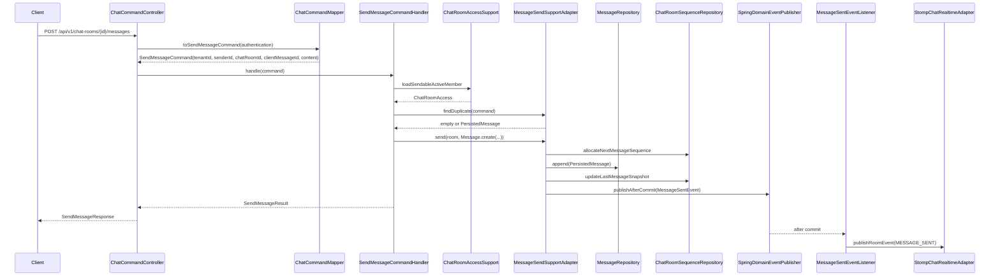
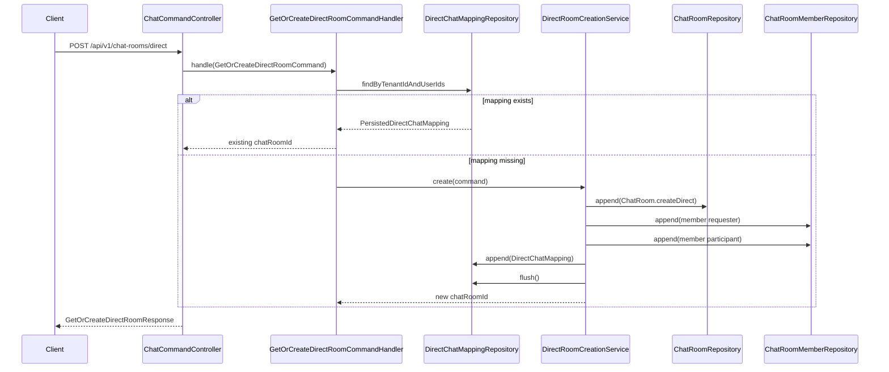
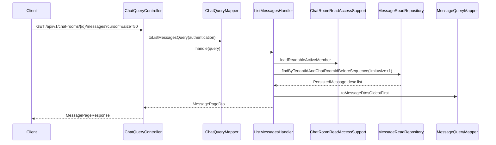
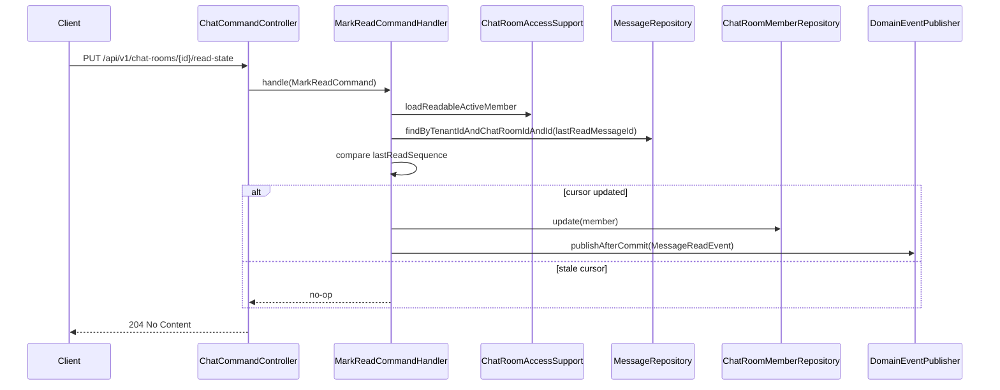
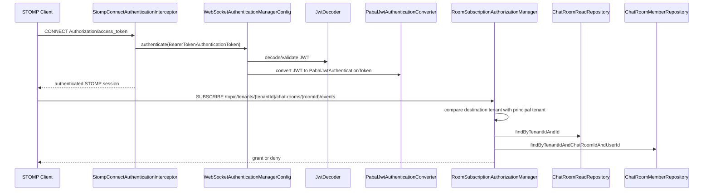

---
tags:
  - pabal
  - sequence
  - endpoint
---

# Pabal 엔드포인트 시퀀스 다이어그램

> 상위 문서: [Pabal 상세 설계 허브](../design/design-hub.md)
> 관련 문서: [Pabal Command-Query 유스케이스 카탈로그](command-query-catalog.md), [Pabal HTTP API 예시와 오류 매핑](http-api-and-error-mapping.md), [Pabal 런타임 흐름](../architecture/runtime-flow.md), [Pabal Realtime 이벤트 스키마](../realtime/event-schema.md)

## SendMessage

Layer: API → Application → Domain → Application Port → Infrastructure Adapter

## GetOrCreateDirectRoom

Layer: API → Application → Domain → Application Port → Infrastructure Adapter

## ListMessages

Layer: API → Application → Application Port → Infrastructure Adapter

## MarkRead

Layer: API → Application → Domain → Application Port → Infrastructure Adapter

## STOMP CONNECT + SUBSCRIBE

Layer: Infrastructure Security → Security → Infrastructure Authorization

